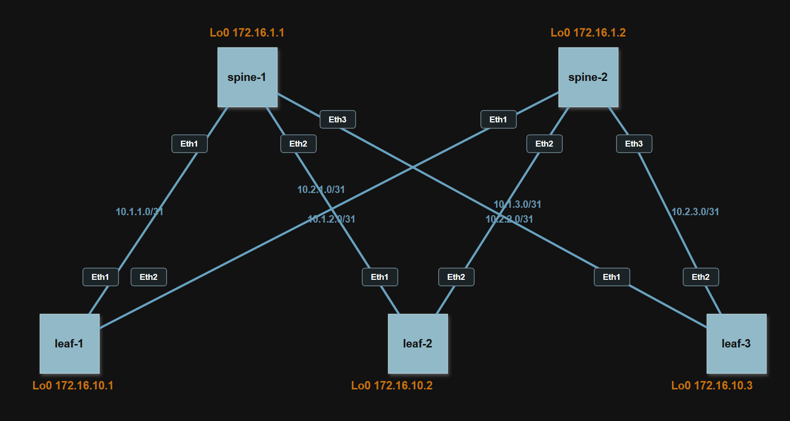

# Проектирование адресного пространства CLOS

## Цель

Собрать схему CLOS/Leaf-Spine и распределить адресное пространство underlay-сети.

## Исходные условия

- Топология: 2 Spine и 3 Leaf.
- Устройства нумеруются слева направо: `spine-1`, `spine-2`, `leaf-1`, `leaf-2`, `leaf-3`.
- Для IPv4 p2p-линков используется диапазон 10.0.0.0/8 и маска `/31`.
- Для IPv6 p2p-линков используется диапазон `fd00:10::/32` и маска `/127`.
- Для IPv4 loopback используется диапазон `172.16.0.0/16`.
- Для IPv6 loopback используется диапазон `fd00:172::/32`.

## План работ

1. Собрать CLOS-топологию из двух Spine и трех Leaf.
2. Назначить p2p-порты между Spine и Leaf.
3. Выделить IPv4/IPv6 адреса для всех p2p underlay-линков.
4. Выделить IPv4/IPv6 loopback-адреса для всех сетевых устройств.
5. Подготовить схему сети и зафиксировать ее в документации.
6. Подготовить настройки Arista EOS для IPv4 L3-интерфейсов и loopback.


## Схема

Схема подготовлена в формате draw.io. Доступна по ссылке на [Google Drive](https://drive.google.com/file/d/19VrhLW9ZiPw8qKsSrZHmV1ohqbYcOyhG)




## Правила адресации

### P2P underlay

IPv4-сеть линка формируется по правилу:

```text
10.<spine_id>.<leaf_id>.0/31
```

IPv6-сеть линка формируется по правилу:

```text
fd00:10:<spine_id>:<leaf_id>::/127
```

Где:

- `spine_id` - номер Spine[1-2].
- `leaf_id` - номер Leaf[1-3].
- Младший адрес p2p-сети назначается на Spine.
- Старший адрес p2p-сети назначается на Leaf.

Например, сеть `10.2.3.0/31` и `fd00:10:2:3::/127` означает линк `spine-2 - leaf-3`.

### Loopback

IPv4 loopback формируется по правилу:

```text
172.16.<role_id>.<device_id>/32
```

IPv6 loopback формируется по правилу:

```text
fd00:172:<role_id>::<device_id>/128
```

Где:

- `role_id = 1` для Spine.
- `role_id = 10` для Leaf.
- `device_id` - номер устройства внутри роли.

## План портов

Порты Spine, направленные к Leaf, сгруппированы в начале интерфейсного диапазона `Ethernet1-3`.
Порты Leaf, направленные к Spine, сгруппированы в начале интерфейсного диапазона `Ethernet1-2`.

| Device | Port | Description | Neighbor |
|---|---|---|---|
| `spine-1` | `Ethernet1` | `to-leaf-1` | `leaf-1 Ethernet1` |
| `spine-1` | `Ethernet2` | `to-leaf-2` | `leaf-2 Ethernet1` |
| `spine-1` | `Ethernet3` | `to-leaf-3` | `leaf-3 Ethernet1` |
| `spine-2` | `Ethernet1` | `to-leaf-1` | `leaf-1 Ethernet2` |
| `spine-2` | `Ethernet2` | `to-leaf-2` | `leaf-2 Ethernet2` |
| `spine-2` | `Ethernet3` | `to-leaf-3` | `leaf-3 Ethernet2` |
| `leaf-1` | `Ethernet1` | `to-spine-1` | `spine-1 Ethernet1` |
| `leaf-1` | `Ethernet2` | `to-spine-2` | `spine-2 Ethernet1` |
| `leaf-2` | `Ethernet1` | `to-spine-1` | `spine-1 Ethernet2` |
| `leaf-2` | `Ethernet2` | `to-spine-2` | `spine-2 Ethernet2` |
| `leaf-3` | `Ethernet1` | `to-spine-1` | `spine-1 Ethernet3` |
| `leaf-3` | `Ethernet2` | `to-spine-2` | `spine-2 Ethernet3` |

## Loopback-адреса

| Device | Interface | IPv4 | IPv6 |
|---|---|---|---|
| `spine-1` | `Loopback0` | `172.16.1.1/32` | `fd00:172:1::1/128` |
| `spine-2` | `Loopback0` | `172.16.1.2/32` | `fd00:172:1::2/128` |
| `leaf-1` | `Loopback0` | `172.16.10.1/32` | `fd00:172:10::1/128` |
| `leaf-2` | `Loopback0` | `172.16.10.2/32` | `fd00:172:10::2/128` |
| `leaf-3` | `Loopback0` | `172.16.10.3/32` | `fd00:172:10::3/128` |

## Адресный план underlay

| Device | Port | Description | IPv4 | IPv6 | Neighbor |
|---|---|---|---|---|---|
| `spine-1` | `Ethernet1` | `to-leaf-1` | `10.1.1.0/31` | `fd00:10:1:1::/127` | `leaf-1` |
| `leaf-1` | `Ethernet1` | `to-spine-1` | `10.1.1.1/31` | `fd00:10:1:1::1/127` | `spine-1` |
| `spine-1` | `Ethernet2` | `to-leaf-2` | `10.1.2.0/31` | `fd00:10:1:2::/127` | `leaf-2` |
| `leaf-2` | `Ethernet1` | `to-spine-1` | `10.1.2.1/31` | `fd00:10:1:2::1/127` | `spine-1` |
| `spine-1` | `Ethernet3` | `to-leaf-3` | `10.1.3.0/31` | `fd00:10:1:3::/127` | `leaf-3` |
| `leaf-3` | `Ethernet1` | `to-spine-1` | `10.1.3.1/31` | `fd00:10:1:3::1/127` | `spine-1` |
| `spine-2` | `Ethernet1` | `to-leaf-1` | `10.2.1.0/31` | `fd00:10:2:1::/127` | `leaf-1` |
| `leaf-1` | `Ethernet2` | `to-spine-2` | `10.2.1.1/31` | `fd00:10:2:1::1/127` | `spine-2` |
| `spine-2` | `Ethernet2` | `to-leaf-2` | `10.2.2.0/31` | `fd00:10:2:2::/127` | `leaf-2` |
| `leaf-2` | `Ethernet2` | `to-spine-2` | `10.2.2.1/31` | `fd00:10:2:2::1/127` | `spine-2` |
| `spine-2` | `Ethernet3` | `to-leaf-3` | `10.2.3.0/31` | `fd00:10:2:3::/127` | `leaf-3` |
| `leaf-3` | `Ethernet2` | `to-spine-2` | `10.2.3.1/31` | `fd00:10:2:3::1/127` | `spine-2` |

## Сводка p2p-сетей

| Link | IPv4 subnet | IPv6 subnet |
|---|---|---|
| `spine-1 - leaf-1` | `10.1.1.0/31` | `fd00:10:1:1::/127` |
| `spine-1 - leaf-2` | `10.1.2.0/31` | `fd00:10:1:2::/127` |
| `spine-1 - leaf-3` | `10.1.3.0/31` | `fd00:10:1:3::/127` |
| `spine-2 - leaf-1` | `10.2.1.0/31` | `fd00:10:2:1::/127` |
| `spine-2 - leaf-2` | `10.2.2.0/31` | `fd00:10:2:2::/127` |
| `spine-2 - leaf-3` | `10.2.3.0/31` | `fd00:10:2:3::/127` |

## Настройки оборудования

Подготовлены настройки для Arista EOS. Они фиксируют базовую IPv4 underlay-адресацию:

- hostname;
- L3-режим на p2p-интерфейсах;
- interface description;
- IPv4 адреса p2p-линков;
- IPv4 loopback-адреса;
- включение IPv4 routing.

IPv6-адресация в этой работе только задокументирована и будет перенесена на оборудование в следующих заданиях.

Конфигурации:

| Устройство | Конфигурация |
|---|---|
| `spine-1` | [configs/spine-1.cfg](configs/spine-1.cfg) |
| `spine-2` | [configs/spine-2.cfg](configs/spine-2.cfg) |
| `leaf-1` | [configs/leaf-1.cfg](configs/leaf-1.cfg) |
| `leaf-2` | [configs/leaf-2.cfg](configs/leaf-2.cfg) |
| `leaf-3` | [configs/leaf-3.cfg](configs/leaf-3.cfg) |
