# Underlay. OSPF

## Цель

Настроить OSPF для underlay-сети, используя адресный план из `lab01`, и ускорить детектирование отказов с помощью BFD. Базовые требования задания закрываются через IPv4 OSPF underlay, IPv6 добавлен как дополнительное расширение.

## Исходные условия

- Используется та же топология `2 Spine и 3 Leaf`, что и в `lab01`.
- Адресный план полностью наследуется из [lab01](../lab01/README.md).
- Базовая часть работы строится на OSPF underlay для IPv4.
- Дополнительно underlay расширен до dual-stack: IPv4 + IPv6.
- Протокол underlay для IPv4: OSPFv2.
- Протокол underlay для IPv6: OSPFv3.
- Все p2p-линки работают в `area 0.0.0.0`.
- На всех uplink-интерфейсах включается BFD.
- В OSPF используется `passive-interface default`, uplink-интерфейсы переводятся в active явно.

## План работ

1. Использовать схему и IPv4/IPv6 адресный план из `lab01`.
2. Сохранить прежнюю нумерацию устройств и назначение портов.
3. Включить OSPFv2 для IPv4 на всех p2p-интерфейсах и loopback.
4. Включить OSPFv3 для IPv6 на всех p2p-интерфейсах и loopback.
5. Для p2p-линков задать тип сети `point-to-point` как для OSPFv2, так и для OSPFv3.
6. Включить BFD на всех uplink-интерфейсах с таймерами `100/100/3`.
7. Включить `passive-interface default` и явно разрешить OSPF только на uplink-интерфейсах.
8. Проверить соседства OSPFv2/OSPFv3, BFD-сессии и связность между loopback-адресами.
9. Зафиксировать схему, адресное пространство и конфигурации устройств в документации.

## Схема

Топология и физическая схема совпадают с первой лабораторной работой.


## Адресное пространство

### Loopback-адреса

| Device | Loopback0 IPv4 | Loopback0 IPv6 |
|---|---|---|
| `spine-1` | `172.16.1.1/32` | `fd00:172:1::1/128` |
| `spine-2` | `172.16.1.2/32` | `fd00:172:1::2/128` |
| `leaf-1` | `172.16.10.1/32` | `fd00:172:10::1/128` |
| `leaf-2` | `172.16.10.2/32` | `fd00:172:10::2/128` |
| `leaf-3` | `172.16.10.3/32` | `fd00:172:10::3/128` |

### P2P underlay

| Link | IPv4-subnet | IPv6-subnet |
|---|---|---|
| `spine-1 - leaf-1` | `10.1.1.0/31` | `fd00:10:1:1::/127` |
| `spine-1 - leaf-2` | `10.1.2.0/31` | `fd00:10:1:2::/127` |
| `spine-1 - leaf-3` | `10.1.3.0/31` | `fd00:10:1:3::/127` |
| `spine-2 - leaf-1` | `10.2.1.0/31` | `fd00:10:2:1::/127` |
| `spine-2 - leaf-2` | `10.2.2.0/31` | `fd00:10:2:2::/127` |
| `spine-2 - leaf-3` | `10.2.3.0/31` | `fd00:10:2:3::/127` |

## OSPF/BFD дизайн

- OSPFv2 process: `65000` (`router ospf 65000`)
- OSPFv3 process: `65000` (`ipv6 router ospf 65000`)
- OSPF area: `0.0.0.0`
- Router ID для OSPFv2 и OSPFv3: IPv4-адрес `Loopback0`
- Тип сети на uplink-интерфейсах: `point-to-point`
- BFD на uplink-интерфейсах: `100/100/3`
- OSPF interface policy: `passive-interface default` + `no passive-interface` только на uplink-интерфейсах
- OSPFv2 authentication: MD5, `key-id 1`
- OSPFv3 authentication в этой работе не настраивается

### Router ID

| Устройство | OSPF router-id |
|---|---|
| `spine-1` | `172.16.1.1` |
| `spine-2` | `172.16.1.2` |
| `leaf-1` | `172.16.10.1` |
| `leaf-2` | `172.16.10.2` |
| `leaf-3` | `172.16.10.3` |

Для OSPFv2 и OSPFv3 используется один и тот же `router-id`, взятый с IPv4 `Loopback0`. Это корректно, потому что в OSPFv3 router-id по-прежнему 32-битный и записывается в IPv4-формате, даже если сам протокол маршрутизирует IPv6-префиксы.

### OSPFv2 Authentication

Для всех p2p uplink-интерфейсов используется:

- authentication type: `message-digest`
- key-id: `1`
- key: `X5RWLmD3yvyXQ8qu`

Для OSPFv3 аутентификация не добавляется. В EOS она настраивается отдельно через OSPFv3 IPsec/AH/ESP, поэтому IPv6 underlay в этой версии лабораторной работы поднимается без OSPFv3 authentication.

### Passive Interface Logic

`passive-interface default` делает все интерфейсы OSPF-пассивными по умолчанию. Это значит:

- интерфейсный префикс может анонсироваться в OSPF;
- hello-пакеты с такого интерфейса не отправляются;
- соседство на таком интерфейсе не поднимается.

В этой лабораторной работе это удобно тем, что OSPF формирует соседства только там, где это действительно нужно: на линках `spine-leaf`. Loopback остается в OSPF, но не пытается строить соседства.

### Ожидаемые соседства

| Устройство | Кол-во OSPF соседей | Кол-во BFD peers |
|---|---:|---:|
| `spine-1` | 3 | 3 |
| `spine-2` | 3 | 3 |
| `leaf-1` | 2 | 2 |
| `leaf-2` | 2 | 2 |
| `leaf-3` | 2 | 2 |

## Конфигурации устройств

Конфигурации Arista EOS:

| Устройство | Конфигурация |
|---|---|
| `spine-1` | [configs/spine-1.eos](configs/spine-1.eos) |
| `spine-2` | [configs/spine-2.eos](configs/spine-2.eos) |
| `leaf-1` | [configs/leaf-1.eos](configs/leaf-1.eos) |
| `leaf-2` | [configs/leaf-2.eos](configs/leaf-2.eos) |
| `leaf-3` | [configs/leaf-3.eos](configs/leaf-3.eos) |

## Проверка

### Проверка IP-связности

Примеры проверок между loopback-адресами:

```text
ping 172.16.10.3 source 172.16.1.1
```
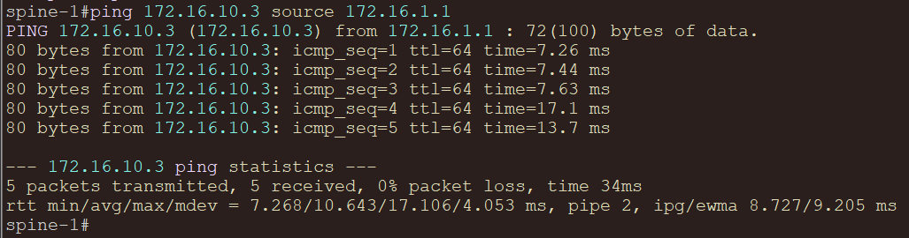
```text
ping 172.16.1.2 source 172.16.10.1
```
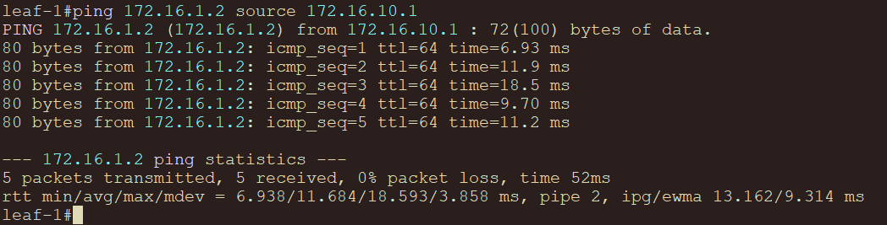
```text
ping 172.16.10.2 source 172.16.10.3
```
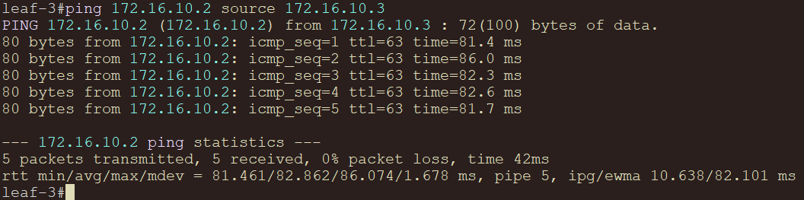
```text
ping ipv6 fd00:172:10::3 source fd00:172:1::1
```
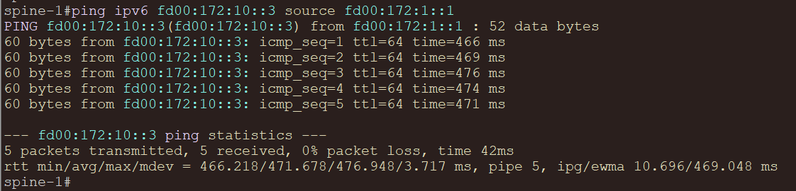
```text
ping ipv6 fd00:172:1::2 source fd00:172:10::1
```
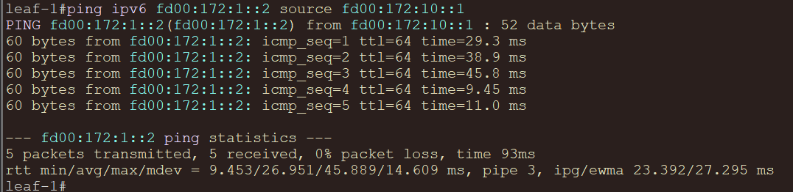
```text
ping ipv6 fd00:172:10::2 source fd00:172:10::3
```
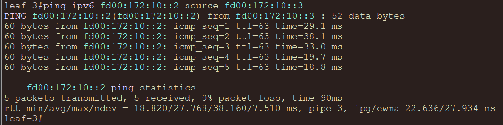

### Проверка OSPF

```text
show ip ospf neighbor
show ip route ospf
show ip ospf interface brief
show ipv6 ospf neighbor
show ipv6 route ospf
show ipv6 ospf interface
```
### Spine:

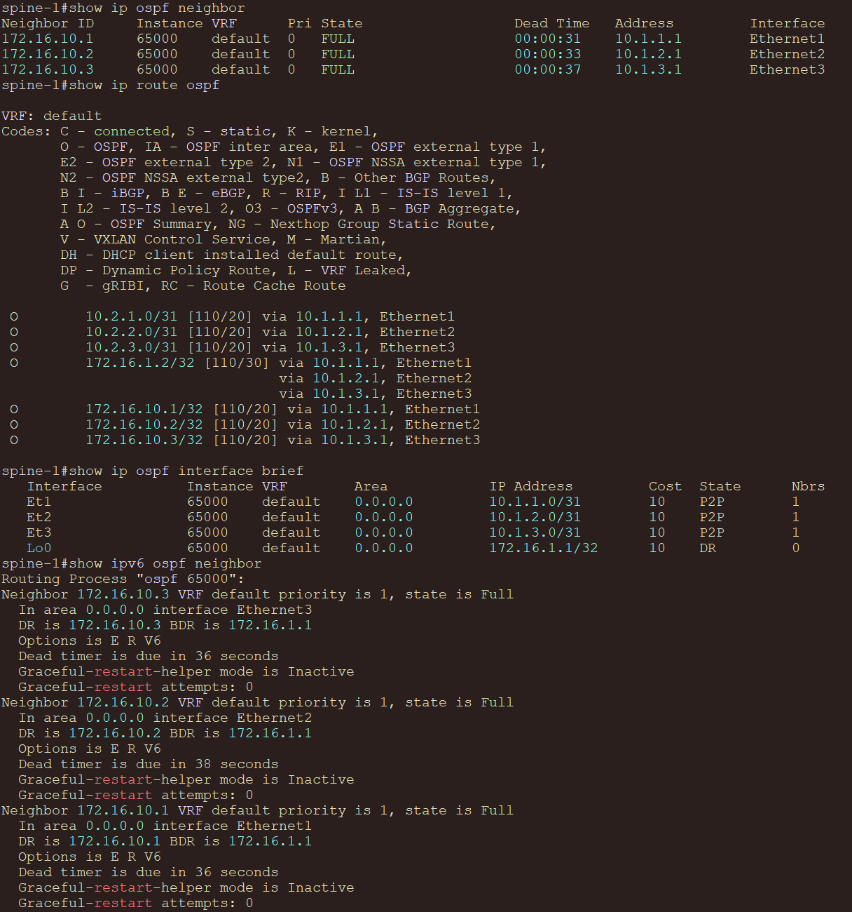

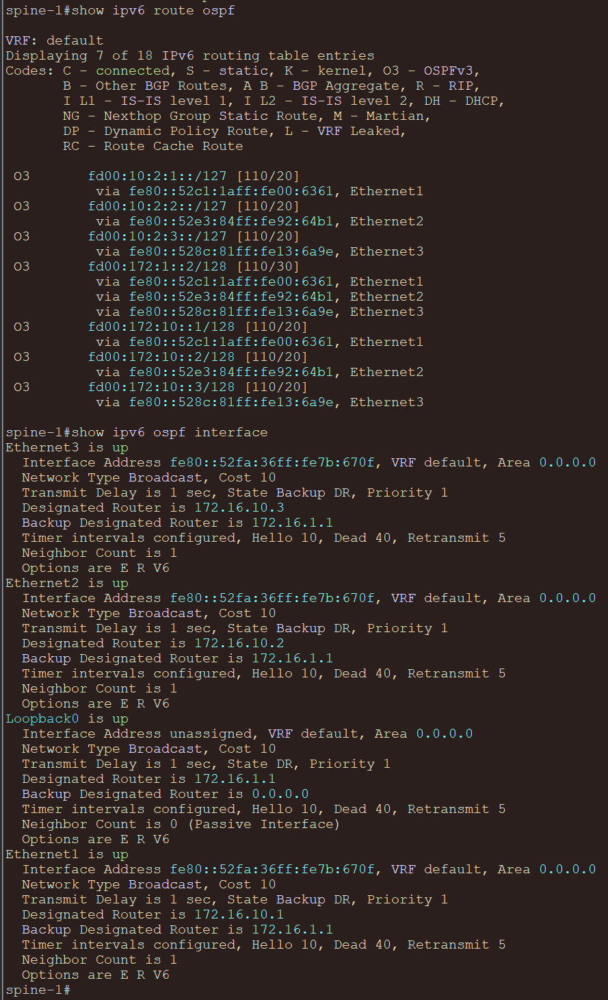

### Leaf:
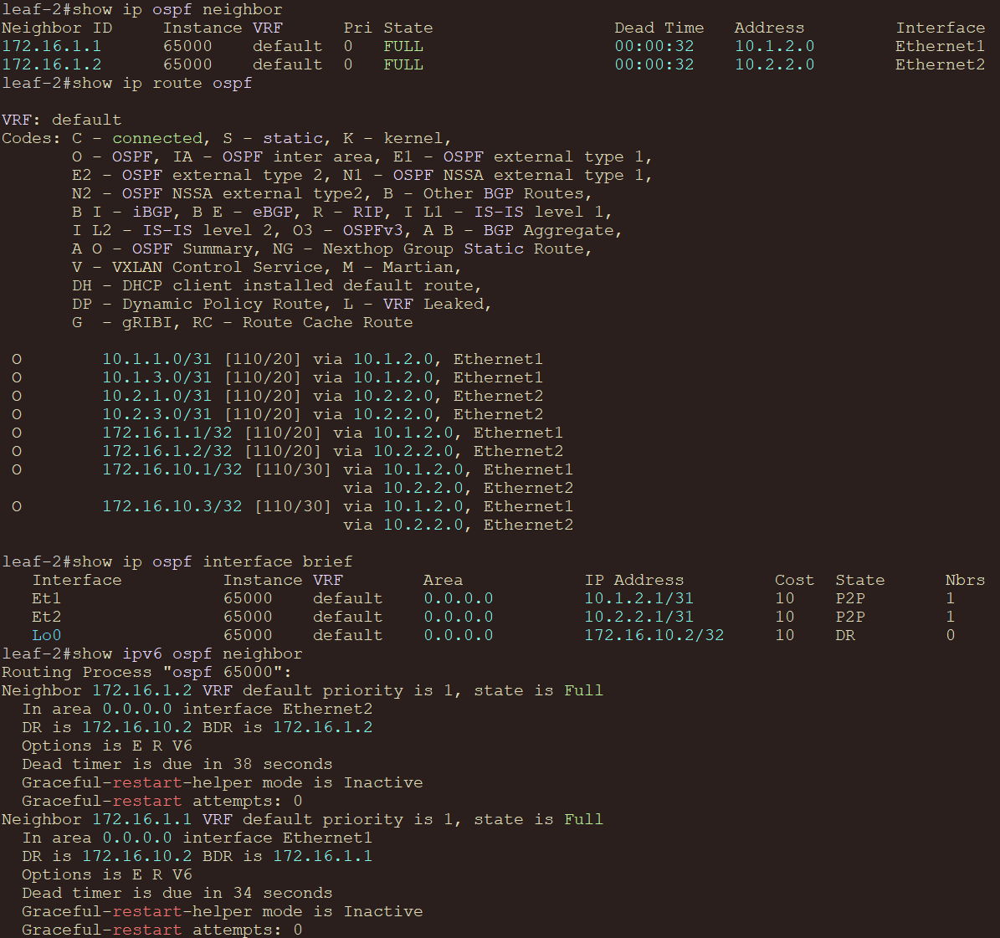

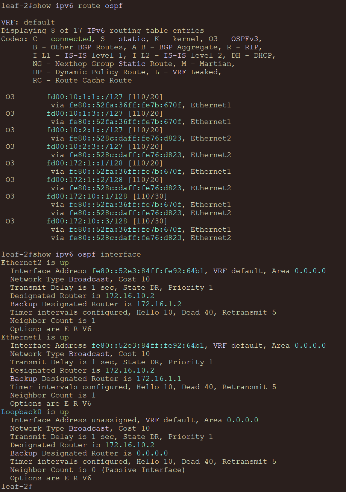


### Проверка BFD

```text
show bfd peers
```
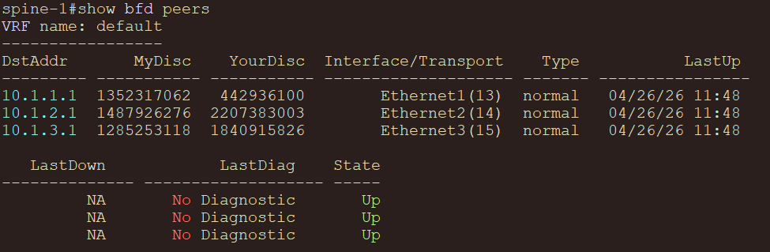

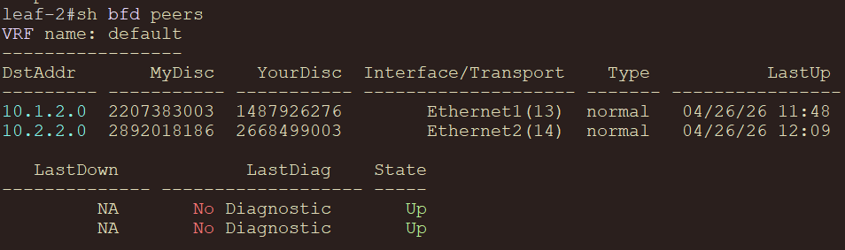
