# Underlay. IS-IS

## Цель

Настроить IS-IS для underlay-сети, используя адресный план из `lab01`. Базовые требования задания закрываются через IPv4 underlay, IPv6 сохранен в той же адресации и поднимается в рамках того же IS-IS домена.

## Исходные условия

- Используется та же топология `2 Spine и 3 Leaf`, что и в `lab01`.
- Адресный план полностью наследуется из [lab01](../lab01/README.md).
- Underlay работает в одном IS-IS flooding domain.
- Все устройства работают только как `level-2`.
- Все spine-leaf линки настраиваются как `p2p`.
- Для уменьшения LSDB и таблиц маршрутизации в IS-IS анонсируются только passive-интерфейсы, то есть `Loopback0`.
- На uplink-интерфейсах включается BFD.
- IPv6 включается в том же IS-IS instance через `address-family ipv6 unicast`.
- Для IPv6 используется `multi-topology`, как в материалах Arista ATD по IS-IS underlay.

## План работ

1. Использовать схему и IPv4/IPv6 адресный план из `lab01`.
2. Сохранить прежнюю нумерацию устройств, портов и loopback-адресов.
3. Создать один IS-IS instance `65000` на всех устройствах.
4. Назначить каждому устройству уникальный NET в области `49.0001`.
5. Включить `is-type level-2` для single flood domain.
6. Включить `address-family ipv4 unicast` и `address-family ipv6 unicast`.
7. Настроить uplink-интерфейсы как IS-IS `point-to-point` и включить на них BFD.
8. Включить `Loopback0` в IS-IS и пометить его как passive.
9. Ограничить анонс префиксов passive-интерфейсами, чтобы в LSDB попадали только loopback-префиксы.
10. Проверить IS-IS соседства, BFD-сессии, таблицы маршрутизации и IP-связность.
11. Зафиксировать схему, адресное пространство и конфигурации устройств в документации.

## Схема

Топология и физическая схема совпадают с первой лабораторной работой.


## Адресное пространство

### Loopback-адреса

| Device | Loopback0 IPv4 | Loopback0 IPv6 |
|---|---|---|
| `spine-1` | `172.16.1.1/32` | `fd00:172:1::1/128` |
| `spine-2` | `172.16.1.2/32` | `fd00:172:1::2/128` |
| `leaf-1` | `172.16.10.1/32` | `fd00:172:10::1/128` |
| `leaf-2` | `172.16.10.2/32` | `fd00:172:10::2/128` |
| `leaf-3` | `172.16.10.3/32` | `fd00:172:10::3/128` |

### P2P underlay

| Link | IPv4-subnet | IPv6-subnet |
|---|---|---|
| `spine-1 - leaf-1` | `10.1.1.0/31` | `fd00:10:1:1::/127` |
| `spine-1 - leaf-2` | `10.1.2.0/31` | `fd00:10:1:2::/127` |
| `spine-1 - leaf-3` | `10.1.3.0/31` | `fd00:10:1:3::/127` |
| `spine-2 - leaf-1` | `10.2.1.0/31` | `fd00:10:2:1::/127` |
| `spine-2 - leaf-2` | `10.2.2.0/31` | `fd00:10:2:2::/127` |
| `spine-2 - leaf-3` | `10.2.3.0/31` | `fd00:10:2:3::/127` |

## IS-IS дизайн

- IS-IS instance: `65000`
- IS-IS area: `49.0001`
- Flooding domain: единый для всех устройств
- IS-IS level: `level-2`
- Uplink тип сети: `isis network point-to-point`
- Passive interface: только `Loopback0`
- Advertise policy: `advertise passive-only`
- BFD:
  - `bfd all-interfaces` в `address-family ipv4 unicast`
  - `bfd all-interfaces` в `address-family ipv6 unicast`
  - `bfd interval 100 min-rx 100 multiplier 3` на uplink-интерфейсах
- IPv6:
  - включен через `address-family ipv6 unicast`
  - используется `multi-topology`
- Dynamic flooding: `lsp flood dynamic level-2`
- Дополнительные меры:
  - `log-adjacency-changes`
  - `redistribute` не используется
  - underlay работает в `default` VRF

### NET-план

В качестве system-id используется понятная нумерация на базе loopback IPv4, чтобы NET было легко сопоставить с устройством.

| Устройство | NET |
|---|---|
| `spine-1` | `49.0001.1720.1601.0001.00` |
| `spine-2` | `49.0001.1720.1601.0002.00` |
| `leaf-1` | `49.0001.1720.1610.0001.00` |
| `leaf-2` | `49.0001.1720.1610.0002.00` |
| `leaf-3` | `49.0001.1720.1610.0003.00` |

### Почему в таблице маршрутизации только loopback-сети

На всех устройствах `Loopback0` помечен как passive, а в `router isis 65000` включена команда `advertise passive-only`.

На твоей версии EOS именно такой синтаксис доступен в CLI и он означает рекламу только connected-префиксов passive-интерфейсов. Из-за этого IS-IS распространяет только loopback-адреса. P2P link-networks остаются connected и используются для формирования соседств, но не анонсируются в IS-IS как отдельные reachability-префиксы.

### Ожидаемые соседства и маршруты

| Устройство | Кол-во IS-IS соседей | Кол-во BFD peers | Remote IPv4 loopbacks | Remote IPv6 loopbacks |
|---|---:|---:|---:|---:|
| `spine-1` | 3 | 3 | 4 | 4 |
| `spine-2` | 3 | 3 | 4 | 4 |
| `leaf-1` | 2 | 2 | 4 | 4 |
| `leaf-2` | 2 | 2 | 4 | 4 |
| `leaf-3` | 2 | 2 | 4 | 4 |

## Конфигурации устройств

Конфигурации Arista EOS:

| Устройство | Конфигурация |
|---|---|
| `spine-1` | [configs/spine-1.eos](configs/spine-1.eos) |
| `spine-2` | [configs/spine-2.eos](configs/spine-2.eos) |
| `leaf-1` | [configs/leaf-1.eos](configs/leaf-1.eos) |
| `leaf-2` | [configs/leaf-2.eos](configs/leaf-2.eos) |
| `leaf-3` | [configs/leaf-3.eos](configs/leaf-3.eos) |

## Проверка

### Проверка IS-IS

```text
show isis neighbors
show isis interface
show isis summary
show isis database detail
show isis hostname
show isis dynamic flooding topology
```

### Spine:

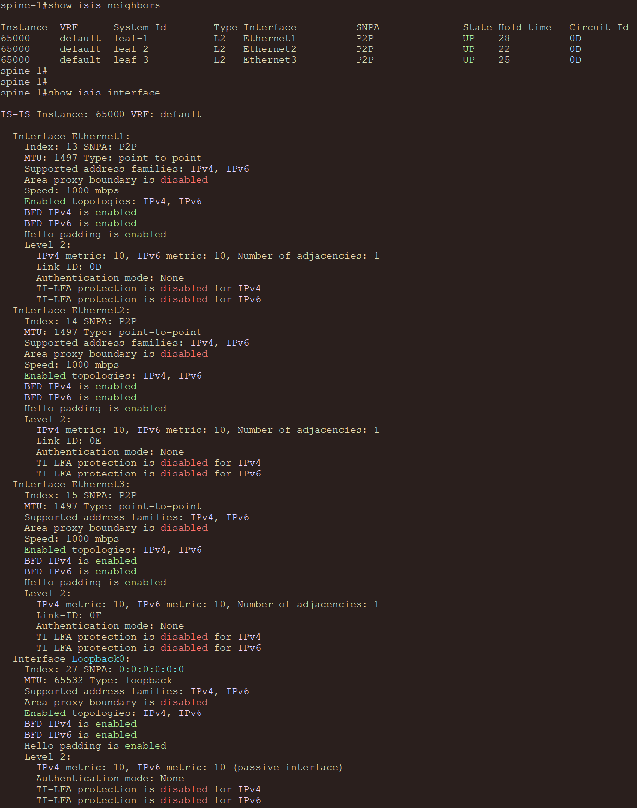
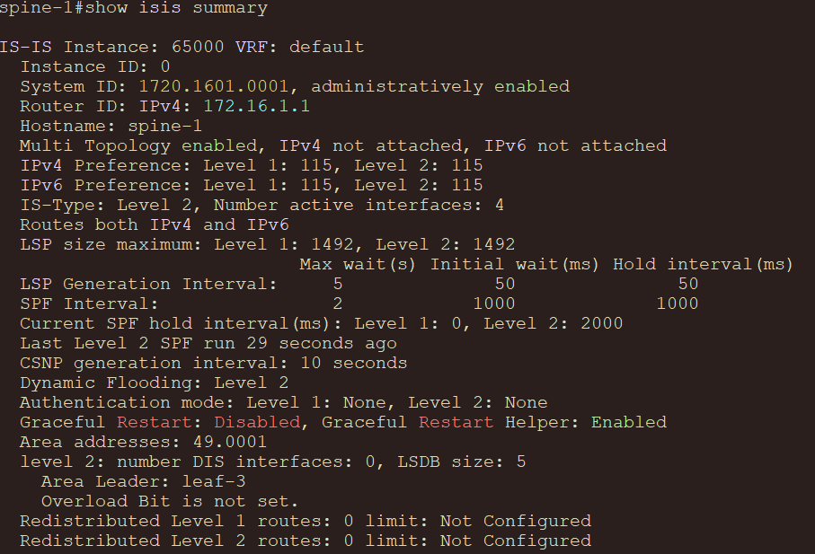
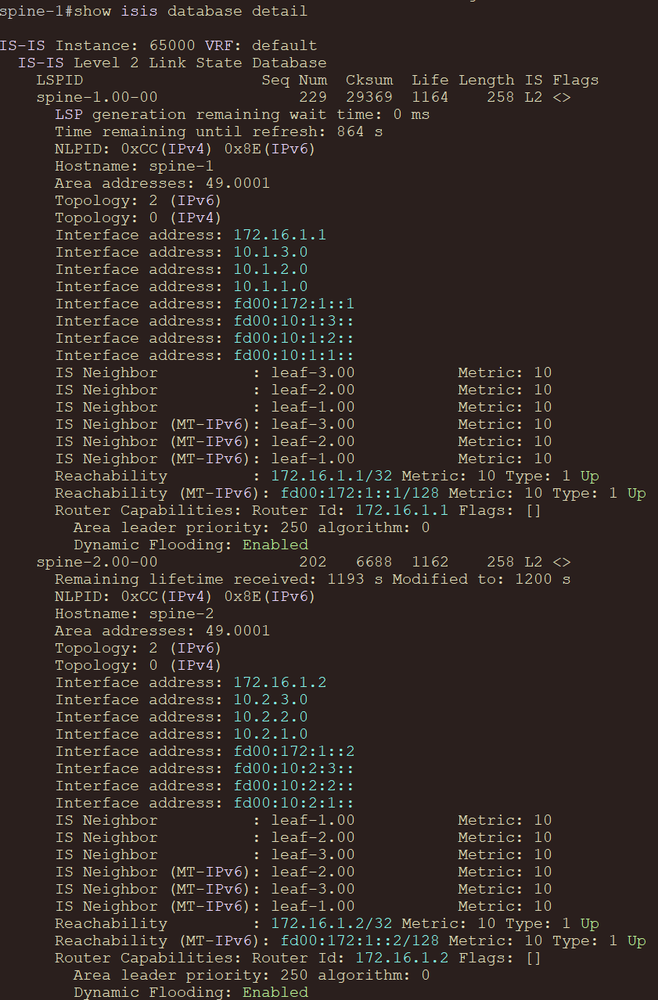
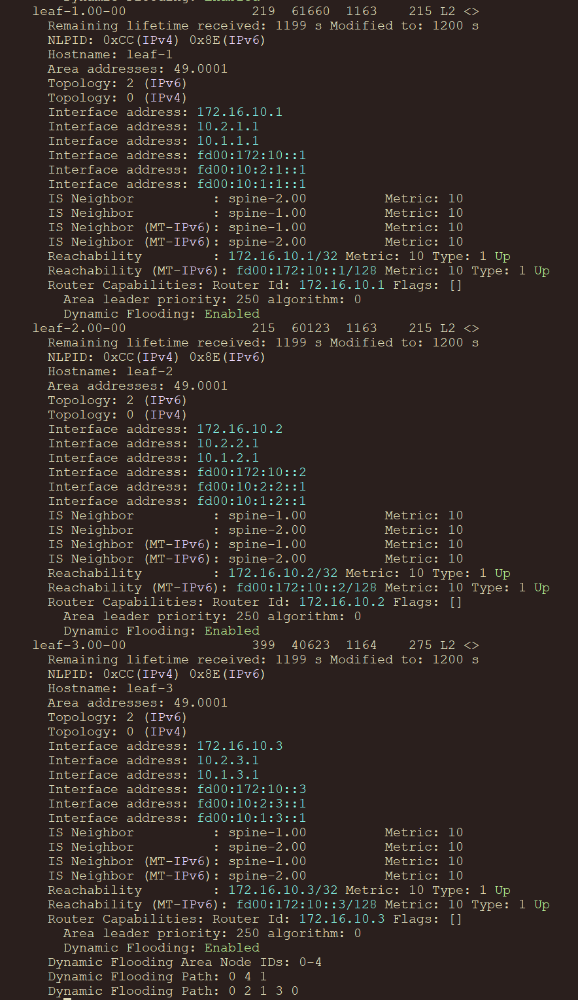
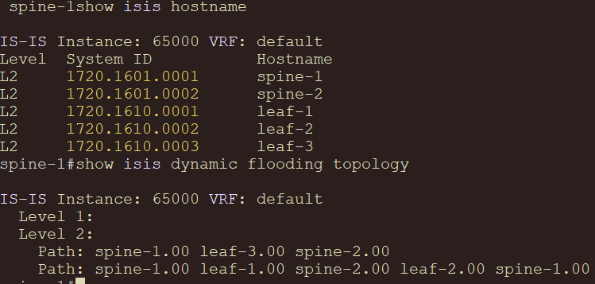


### Leaf:

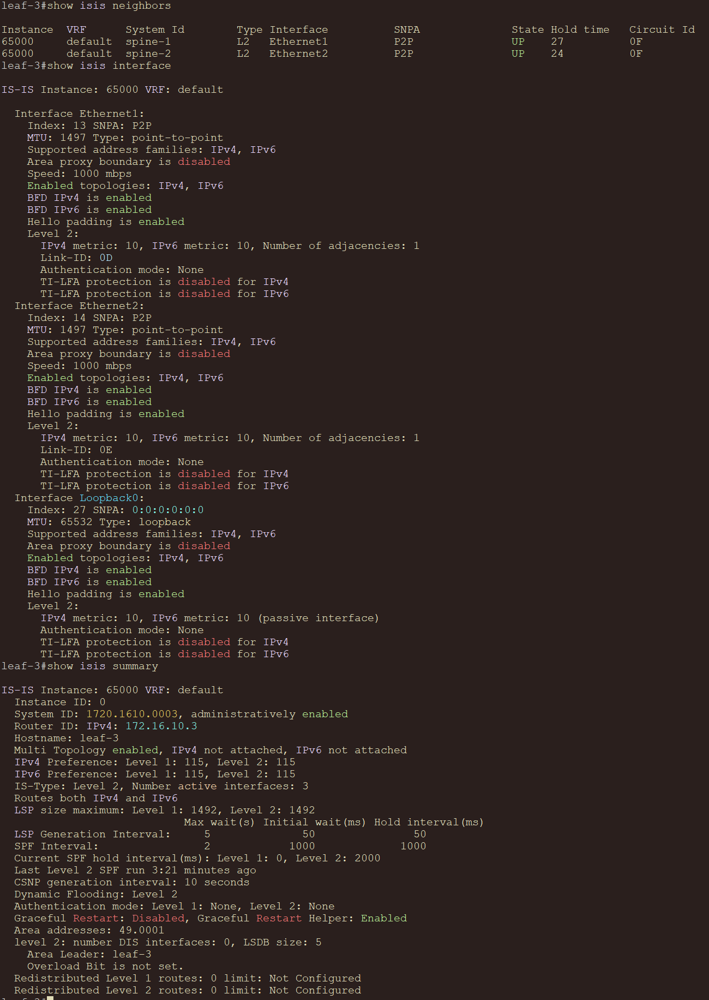
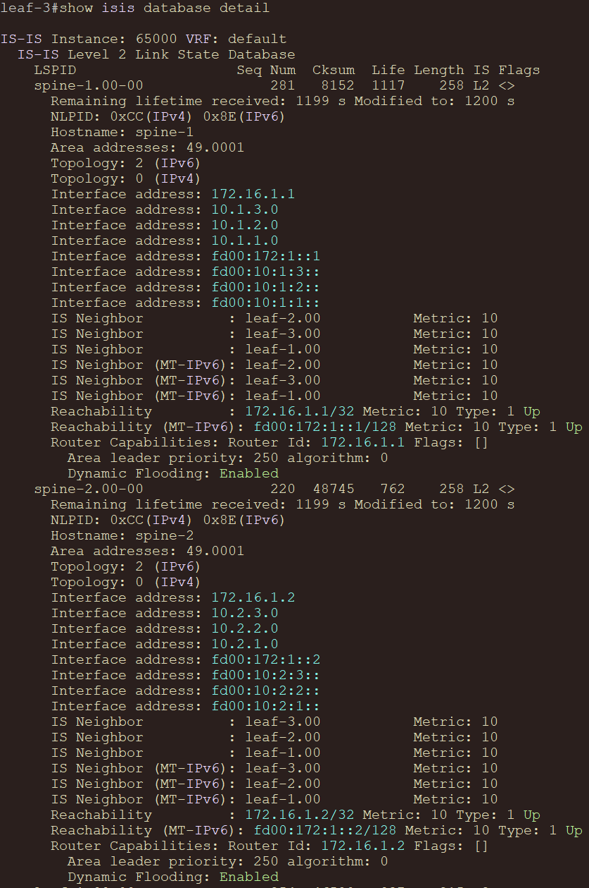
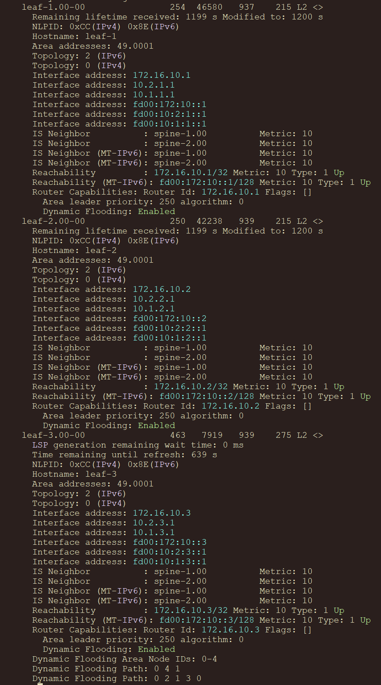
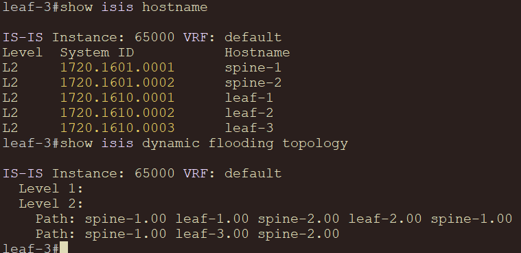


### Проверка маршрутов

В таблице будут только loopback'и, полученные по IS-IS.

```text
show ip route isis
show ipv6 route isis
```

### Spine:

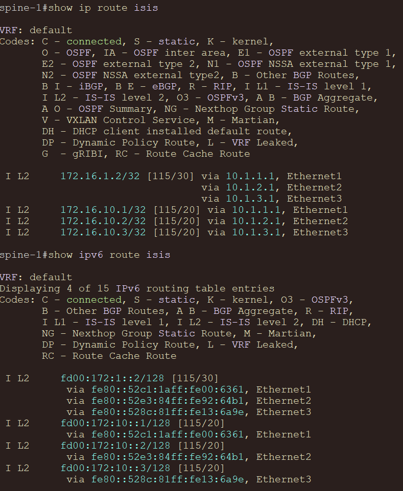

### Leaf:

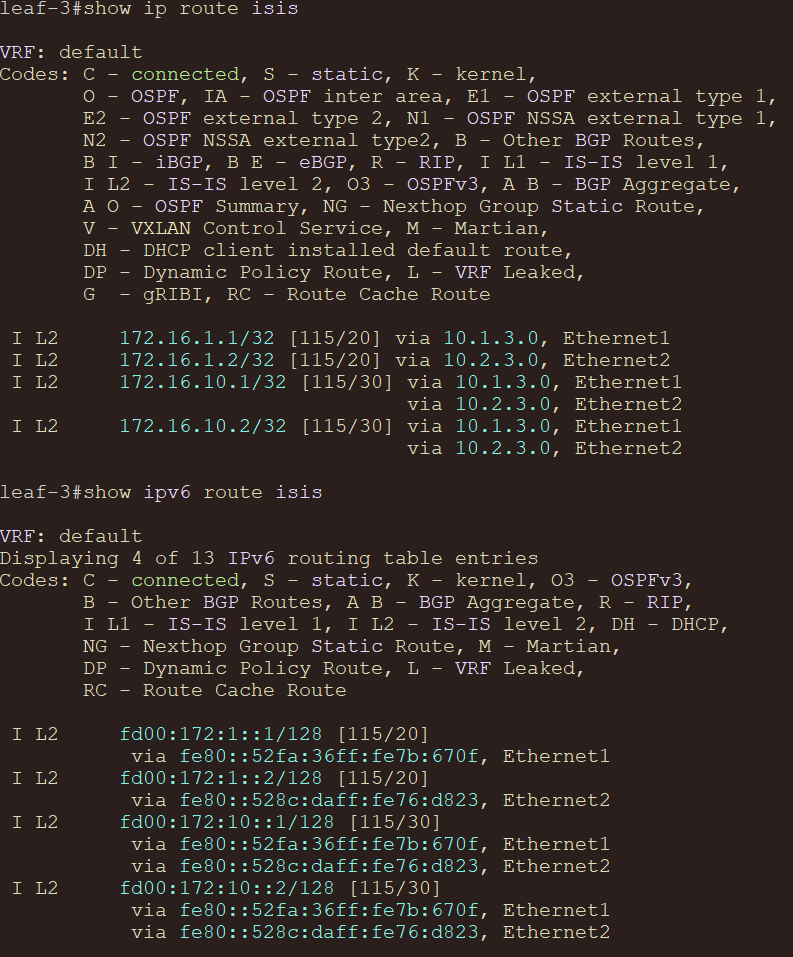

### Проверка BFD

```text
show bfd peers
```

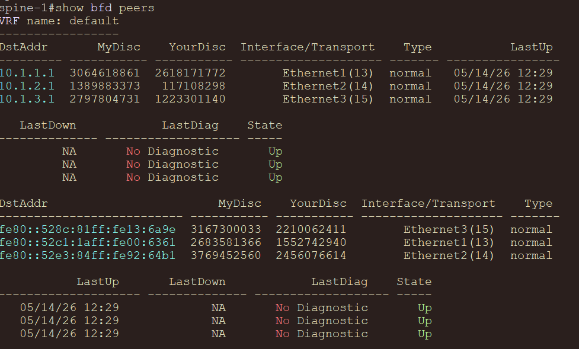
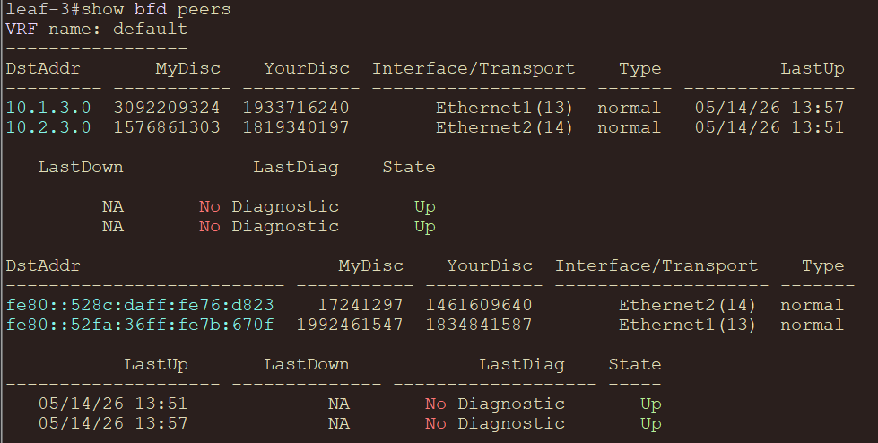

### Проверка IP-связности

Примеры проверок между loopback-адресами:

```text
ping 172.16.10.3 source 172.16.1.1
```
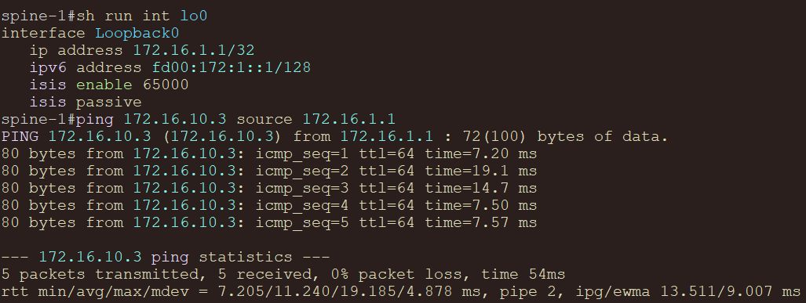
```
ping 172.16.1.2 source 172.16.10.1
```
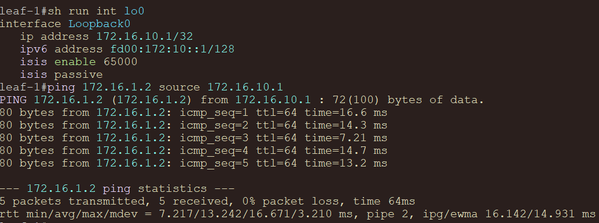
```
ping 172.16.10.2 source 172.16.10.3
```
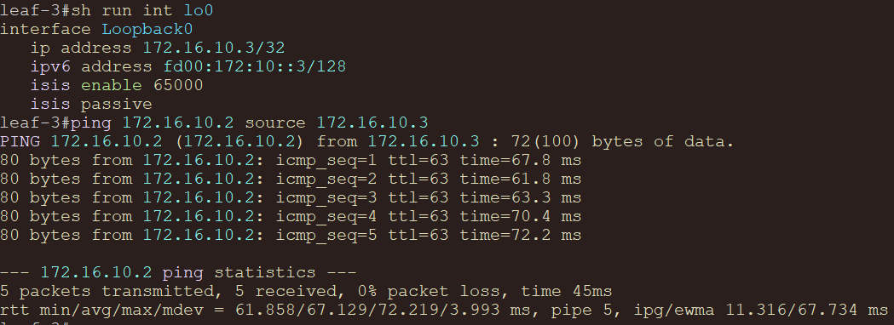
```
ping ipv6 fd00:172:10::3 source fd00:172:1::1
```
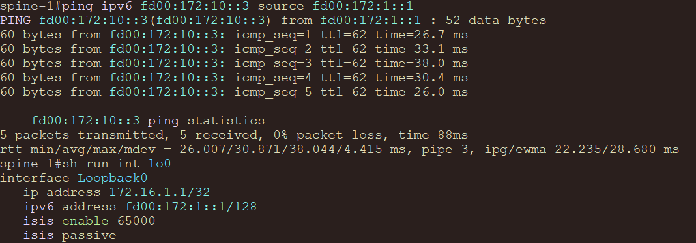
```
ping ipv6 fd00:172:1::2 source fd00:172:10::1
```
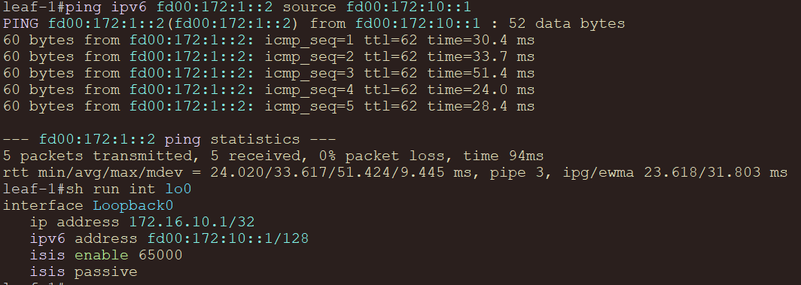
```
ping ipv6 fd00:172:10::2 source fd00:172:10::3
```
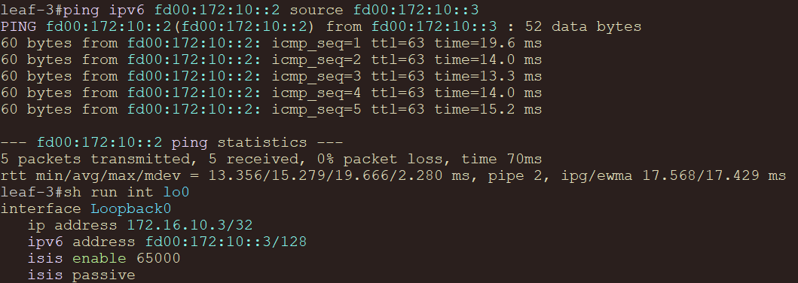
