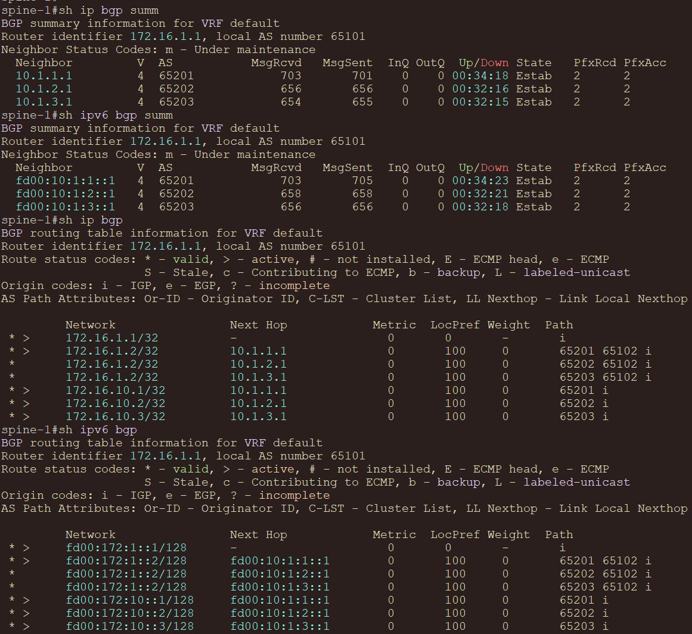
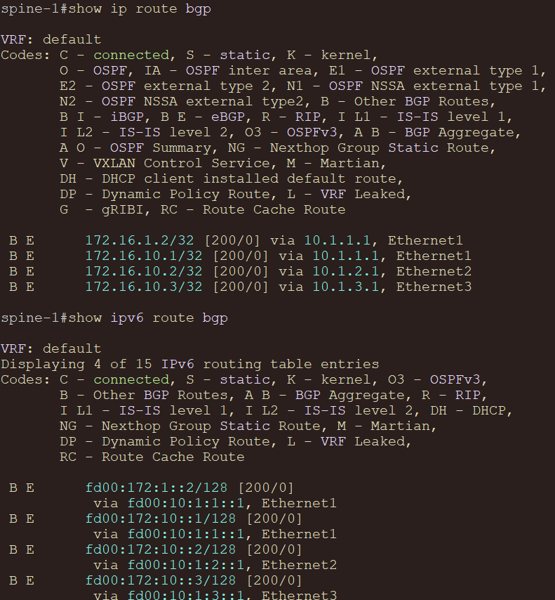
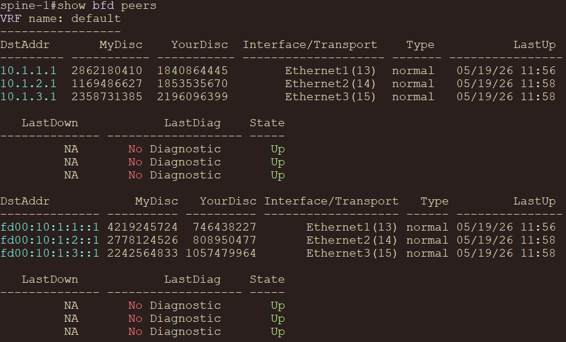
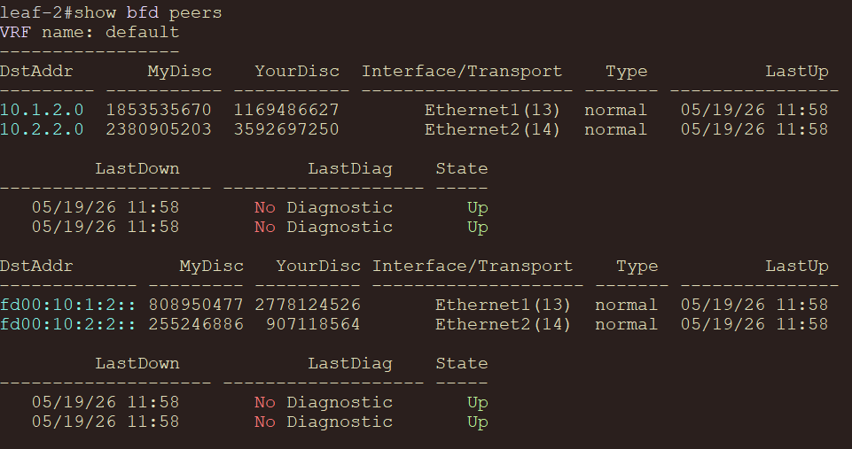
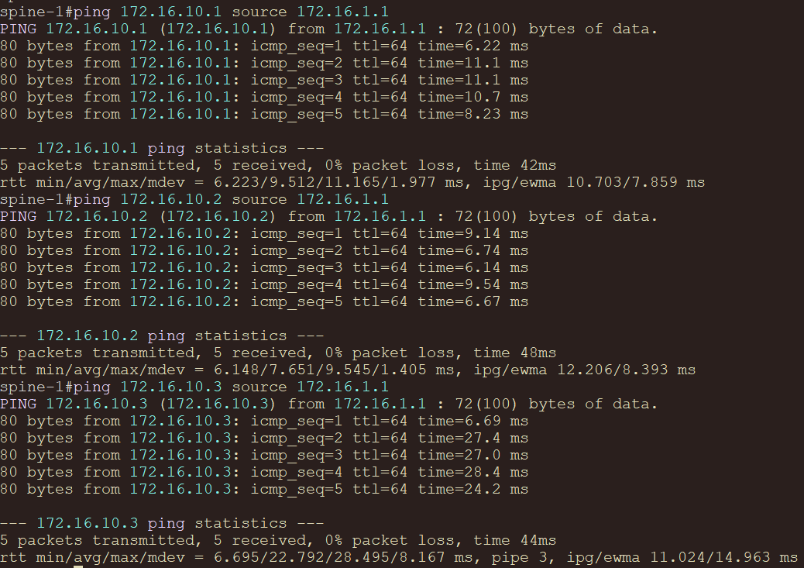
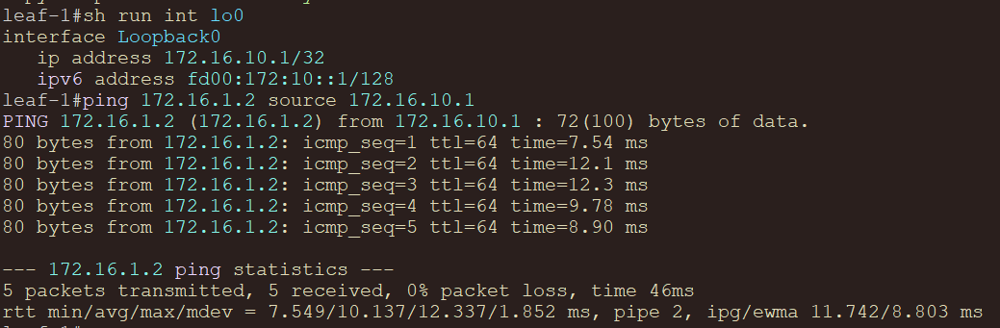
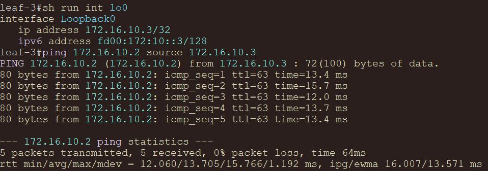
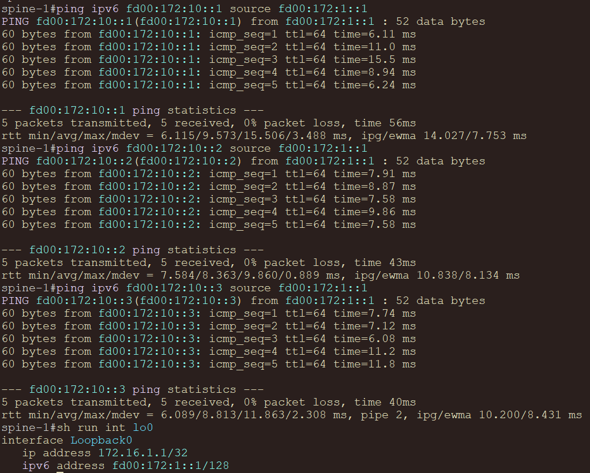
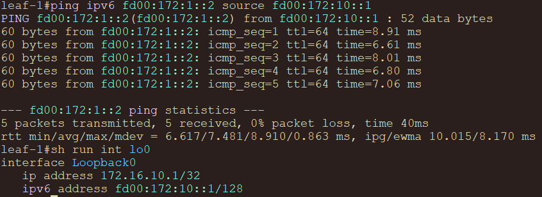
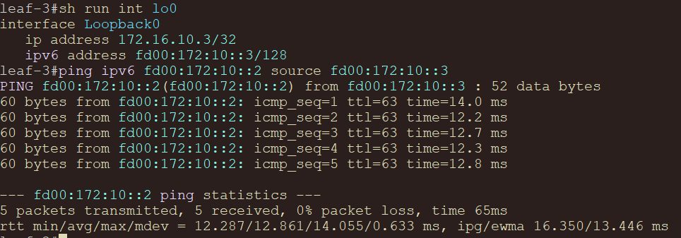

# Underlay. BGP

## Цель

Настроить BGP для underlay-сети, используя адресный план из `lab01`, и обеспечить IP-связность между всеми сетевыми устройствами в BGP-домене.

## Исходные условия

- Используется топология `2 Spine и 3 Leaf`, из `lab01`.
- Адресный план наследуется из [lab01](../lab01/README.md).
- В рамках этой лабораторной работы BGP underlay строится на IPv4 и IPv6 eBGP-сессиях поверх p2p линков.
- IPv4 p2p-связность использует `/31`, IPv6 p2p-связность использует `/127`.
- На всех BGP-сессиях включается BFD и парольная защита.
- В BGP анонсируются только loopback-префиксы устройств.

## Выбор eBGP или iBGP

Для этой лабораторной работы выбран `eBGP`.

Аргументы:

- eBGP естественно ложится на spine-leaf underlay: соседства строятся только между напрямую подключенными устройствами;
- не нужны route-reflector'ы, full-mesh iBGP или дополнительная логика `next-hop-self`;
- loop prevention обеспечивается через `AS_PATH`;
- проще получить ECMP через spine-уровень с помощью `maximum-paths` и `bgp bestpath as-path multipath-relax match 1`;
- конфигурация остается минимальной и хорошо читаемой.

iBGP для этой схемы тоже можно поднять, но для underlay он требует больше служебной логики: route-reflector'ы или full-mesh, контроль next-hop и отдельную политику распространения маршрутов. Для учебной CLOS-топологии это усложняет решение без явной пользы.

## План работ

1. Использовать схему и IPv4/IPv6 адресный план из `lab01`.
2. Назначить уникальный private ASN каждому устройству.
3. Настроить eBGP-соседства только между напрямую подключенными `spine-leaf` интерфейсами.
4. На spine использовать dynamic BGP neighbors для IPv4/IPv6 через `peer-group` и `peer-filter`.
5. Включить BFD, парольную защиту и BGP timers `10/30` на всех p2p BGP-сессиях.
6. Анонсировать в BGP только IPv4/IPv6 loopback-префиксы через `network`.
7. Включить `maximum-paths 10` и `bgp bestpath as-path multipath-relax match 1` для ECMP.
8. Проверить BGP-соседства, BFD-сессии, BGP/RIB маршруты и IP-связность между loopback-адресами.
9. Зафиксировать схему, адресное пространство и конфигурации устройств в документации.

## Схема


## Адресное пространство

### Loopback-адреса

| Device | Loopback0 IPv4 | Loopback0 IPv6 |
|---|---|---|
| `spine-1` | `172.16.1.1/32` | `fd00:172:1::1/128` |
| `spine-2` | `172.16.1.2/32` | `fd00:172:1::2/128` |
| `leaf-1` | `172.16.10.1/32` | `fd00:172:10::1/128` |
| `leaf-2` | `172.16.10.2/32` | `fd00:172:10::2/128` |
| `leaf-3` | `172.16.10.3/32` | `fd00:172:10::3/128` |

### P2P underlay

| Link | IPv4-subnet | IPv6-subnet |
|---|---|---|
| `spine-1 - leaf-1` | `10.1.1.0/31` | `fd00:10:1:1::/127` |
| `spine-1 - leaf-2` | `10.1.2.0/31` | `fd00:10:1:2::/127` |
| `spine-1 - leaf-3` | `10.1.3.0/31` | `fd00:10:1:3::/127` |
| `spine-2 - leaf-1` | `10.2.1.0/31` | `fd00:10:2:1::/127` |
| `spine-2 - leaf-2` | `10.2.2.0/31` | `fd00:10:2:2::/127` |
| `spine-2 - leaf-3` | `10.2.3.0/31` | `fd00:10:2:3::/127` |

## eBGP дизайн

- Underlay protocol: `eBGP`
- BGP ASN range: private ASN
- BGP-сессии: single-hop по p2p IPv4 и IPv6 адресам
- Spine IPv4/IPv6 neighbors: dynamic через `bgp listen range`
- Leaf IPv4/IPv6 neighbors: статические соседи до двух spine
- Advertise policy: только `Loopback0 IPv4/IPv6` через `network`
- P2P-сети: не анонсируются в BGP
- ECMP:
  - `maximum-paths 10`
  - `bgp bestpath as-path multipath-relax match 1`
- Fast convergence:
  - `neighbor ... bfd`
  - `bfd interval 500 min-rx 500 multiplier 3`
  - `timers 10 30`
- Session protection:
  - `neighbor ... password`
  - к `spine-1`: `X5RWLmD3yvyXQ8qu`
  - к `spine-2`: `N7qV2pL9sT4xWc6a`
- Communities:
  - `neighbor ... send-community`
  - community-based policy в этой работе не применяется, но передача communities включена для будущих сценариев обслуживания и traffic engineering
- `redistribute direct` не используется
- Underlay работает в `default` VRF

### Таймеры BFD/BGP

Для PNETLab с ограниченными CPU/RAM используются умеренные таймеры:

- BFD: `500 ms / 500 ms / multiplier 3`
- BGP keepalive/hold: `10/30`

Изначально более агрессивные значения `100/100/3` для BFD и `3/9` для BGP давали быстрый failover, но в виртуальной лаборатории могут приводить к ложным `CtrlTimeout` и перезапускам BGP-сессий.

### BGP communities

На всех eBGP-соседствах включена команда `neighbor ... send-community`.

Сейчас маршруты не маркируются communities и route-map policy не применяется, поэтому поведение underlay не меняется. Команда нужна как подготовка под будущие сценарии: graceful shutdown, maintenance mode, traffic engineering через standard/extended/large communities.

### Dynamic BGP neighbors на spine

На spine-устройствах leaf-соседи не перечисляются по одному. Для IPv4 используется peer-group `pg-leafs`, для IPv6 - `pg-leafs-v6`, а допустимые ASN leaf-устройств ограничиваются peer-filter `pf-leaf-asns`.

Для `spine-1` разрешается подсеть `10.1.0.0/16`, где по принятому адресному плану leaf-адреса находятся в виде `10.1.<leaf_id>.1`.

```text
peer-filter pf-leaf-asns
   10 match as-range 65200-65299 result accept
!
router bgp 65101
   neighbor pg-leafs peer group
   neighbor pg-leafs bfd
   neighbor pg-leafs password X5RWLmD3yvyXQ8qu
   neighbor pg-leafs send-community
   neighbor pg-leafs timers 10 30
   bgp listen range 10.1.0.0/16 peer-group pg-leafs peer-filter pf-leaf-asns
   neighbor pg-leafs-v6 peer group
   neighbor pg-leafs-v6 bfd
   neighbor pg-leafs-v6 password X5RWLmD3yvyXQ8qu
   neighbor pg-leafs-v6 send-community
   neighbor pg-leafs-v6 timers 10 30
   bgp listen range fd00:10:1::/48 peer-group pg-leafs-v6 peer-filter pf-leaf-asns
   !
   address-family ipv6
      neighbor pg-leafs-v6 activate
```

Для `spine-2` используется такой же подход, но listen range меняется на `10.2.0.0/16` и `fd00:10:2::/48`.

```text
peer-filter pf-leaf-asns
   10 match as-range 65200-65299 result accept
!
router bgp 65102
   neighbor pg-leafs peer group
   neighbor pg-leafs bfd
   neighbor pg-leafs password N7qV2pL9sT4xWc6a
   neighbor pg-leafs send-community
   neighbor pg-leafs timers 10 30
   bgp listen range 10.2.0.0/16 peer-group pg-leafs peer-filter pf-leaf-asns
   neighbor pg-leafs-v6 peer group
   neighbor pg-leafs-v6 bfd
   neighbor pg-leafs-v6 password N7qV2pL9sT4xWc6a
   neighbor pg-leafs-v6 send-community
   neighbor pg-leafs-v6 timers 10 30
   bgp listen range fd00:10:2::/48 peer-group pg-leafs-v6 peer-filter pf-leaf-asns
   !
   address-family ipv6
      neighbor pg-leafs-v6 activate
```


### BGP session passwords

Пароли различаются по spine-устройствам. На leaf-устройствах пароль выбирается по направлению соседства.

| Соседство | Password |
|---|---|
| Все сессии к `spine-1` | `X5RWLmD3yvyXQ8qu` |
| Все сессии к `spine-2` | `N7qV2pL9sT4xWc6a` |

### ASN-план

Для этой лабораторной работы выбран уникальный ASN на каждое устройство. Это немного отличается от типовых схем, где все spine могут находиться в одном ASN, но в нашей топологии такой подход позволяет обеспечить связность между всеми устройствами без `allowas-in`.

| Устройство | ASN | Router ID |
|---|---:|---|
| `spine-1` | `65101` | `172.16.1.1` |
| `spine-2` | `65102` | `172.16.1.2` |
| `leaf-1` | `65201` | `172.16.10.1` |
| `leaf-2` | `65202` | `172.16.10.2` |
| `leaf-3` | `65203` | `172.16.10.3` |

### Почему не общий ASN на spine

В production CLOS часто используют схему, где каждый leaf имеет свой ASN, а все spine одного pod находятся в общем ASN. В нашей лабораторной топологии это может помешать полной связности между `spine-1` и `spine-2`: spine может отбросить маршрут до другого spine, если увидит свой же ASN в `AS_PATH`.

Чтобы не добавлять `allowas-in` и не усложнять underlay, здесь используется уникальный ASN per device.

## BGP-соседства

### Spine dynamic neighbors

| Устройство | AF | Listen range | Peer-group | Peer-filter | Допустимые remote ASN |
|---|---|---|---|---|---|
| `spine-1` | IPv4 | `10.1.0.0/16` | `pg-leafs` | `pf-leaf-asns` | `65200-65299` |
| `spine-1` | IPv6 | `fd00:10:1::/48` | `pg-leafs-v6` | `pf-leaf-asns` | `65200-65299` |
| `spine-2` | IPv4 | `10.2.0.0/16` | `pg-leafs` | `pf-leaf-asns` | `65200-65299` |
| `spine-2` | IPv6 | `fd00:10:2::/48` | `pg-leafs-v6` | `pf-leaf-asns` | `65200-65299` |

### IPv4 leaf static neighbors

| Устройство | Neighbor | Remote ASN |
|---|---|---:|
| `leaf-1` | `10.1.1.0` | `65101` |
| `leaf-1` | `10.2.1.0` | `65102` |
| `leaf-2` | `10.1.2.0` | `65101` |
| `leaf-2` | `10.2.2.0` | `65102` |
| `leaf-3` | `10.1.3.0` | `65101` |
| `leaf-3` | `10.2.3.0` | `65102` |

### IPv6 leaf static neighbors

| Устройство | Neighbor | Remote ASN |
|---|---|---:|
| `leaf-1` | `fd00:10:1:1::` | `65101` |
| `leaf-1` | `fd00:10:2:1::` | `65102` |
| `leaf-2` | `fd00:10:1:2::` | `65101` |
| `leaf-2` | `fd00:10:2:2::` | `65102` |
| `leaf-3` | `fd00:10:1:3::` | `65101` |
| `leaf-3` | `fd00:10:2:3::` | `65102` |

### Ожидаемые соседства и маршруты

| Устройство | IPv4 BGP neighbors | IPv6 BGP neighbors | BFD peers | Remote IPv4/IPv6 loopbacks |
|---|---:|---:|---:|---:|
| `spine-1` | 3 | 3 | 6 | 4 |
| `spine-2` | 3 | 3 | 6 | 4 |
| `leaf-1` | 2 | 2 | 4 | 4 |
| `leaf-2` | 2 | 2 | 4 | 4 |
| `leaf-3` | 2 | 2 | 4 | 4 |

## Конфигурации устройств

Конфигурации Arista EOS:

| Устройство | Конфигурация |
|---|---|
| `spine-1` | [configs/spine-1.eos](configs/spine-1.eos) |
| `spine-2` | [configs/spine-2.eos](configs/spine-2.eos) |
| `leaf-1` | [configs/leaf-1.eos](configs/leaf-1.eos) |
| `leaf-2` | [configs/leaf-2.eos](configs/leaf-2.eos) |
| `leaf-3` | [configs/leaf-3.eos](configs/leaf-3.eos) |

## Проверка

### Проверка BGP

```text
show ip bgp summary
show bgp ipv6 unicast summary
show ip bgp
show bgp ipv6 unicast
show ip route bgp
show ipv6 route bgp
```




### Проверка BFD

```text
show bfd peers
```



### Проверка IP-связности

Примеры проверок между loopback-адресами:

```text
ping 172.16.10.1 source 172.16.1.1
ping 172.16.10.2 source 172.16.1.1
ping 172.16.10.3 source 172.16.1.1
```

```
ping 172.16.1.2 source 172.16.10.1
```

```
ping 172.16.10.2 source 172.16.10.3
```

```
ping ipv6 fd00:172:10::1 source fd00:172:1::1
ping ipv6 fd00:172:10::2 source fd00:172:1::1
ping ipv6 fd00:172:10::3 source fd00:172:1::1
```

```
ping ipv6 fd00:172:1::2 source fd00:172:10::1
```

```
ping ipv6 fd00:172:10::2 source fd00:172:10::3
```

