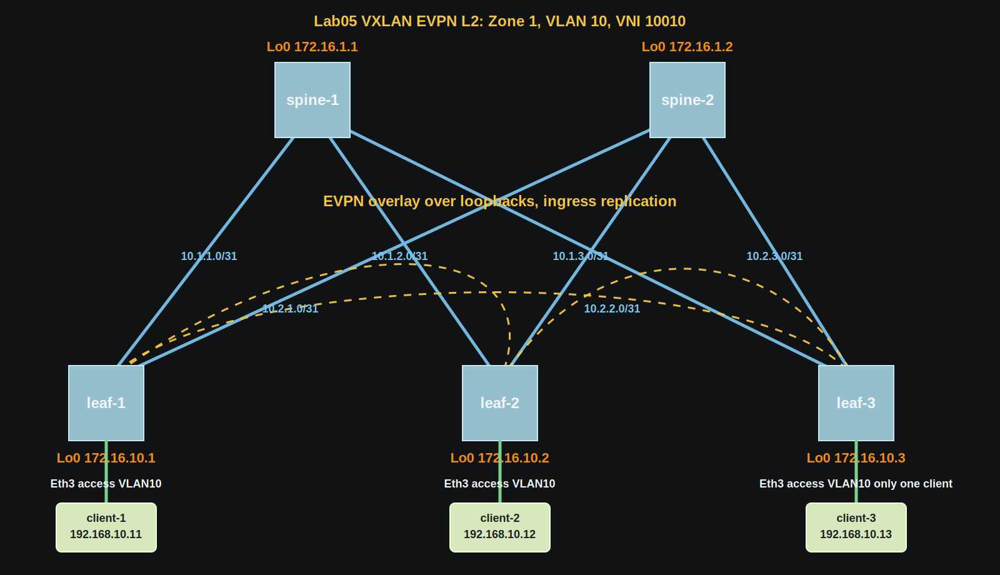
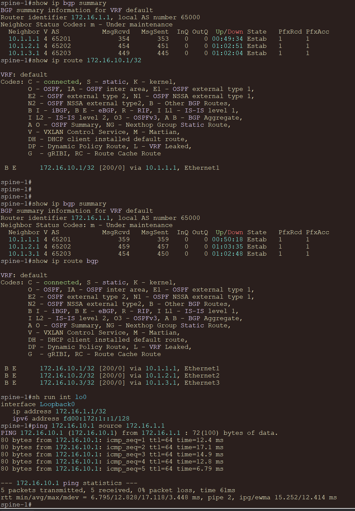
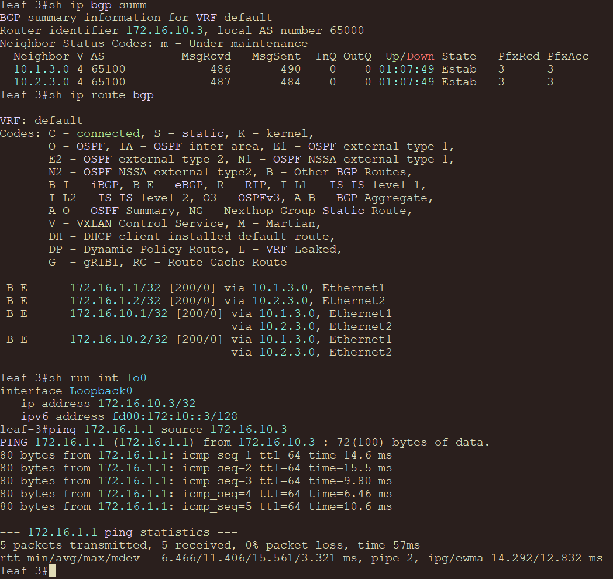
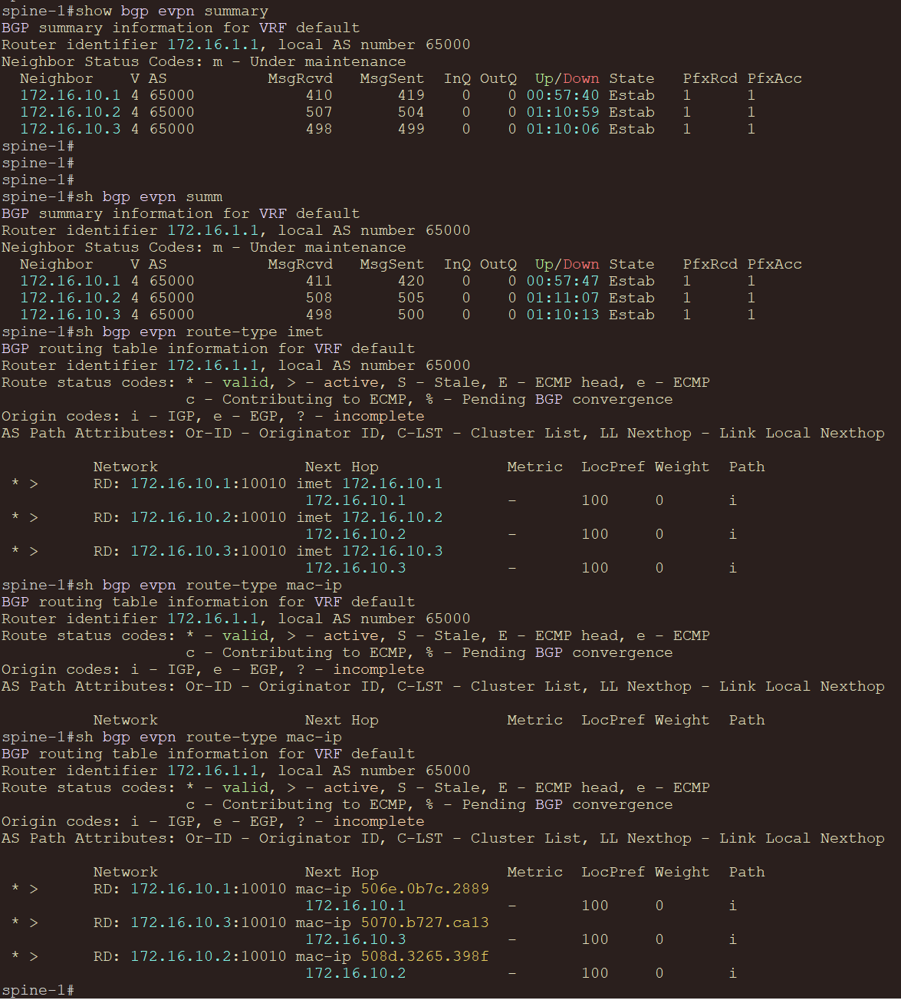
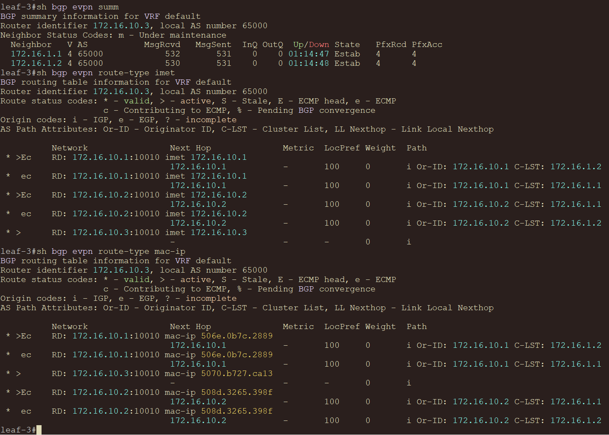
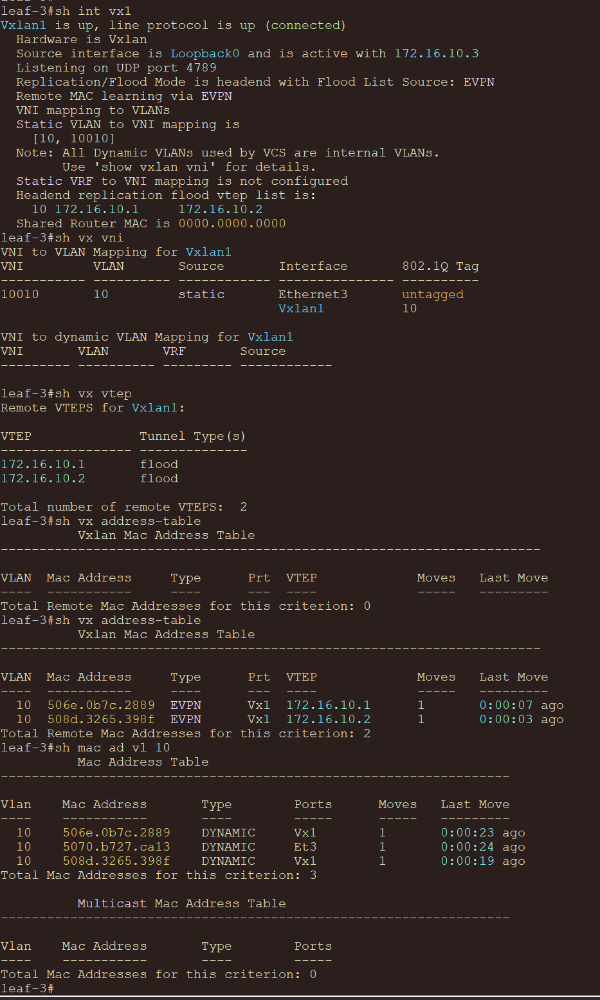
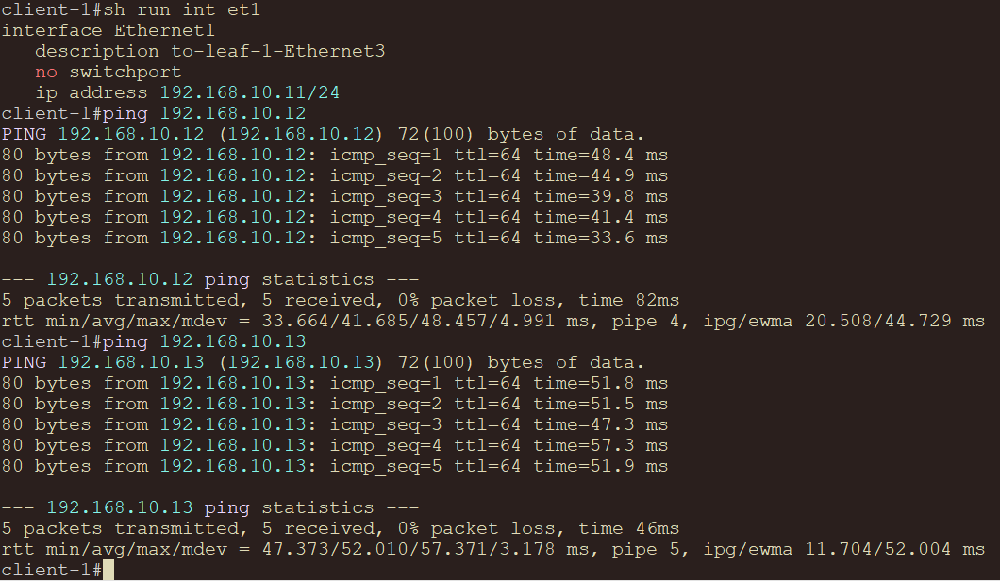
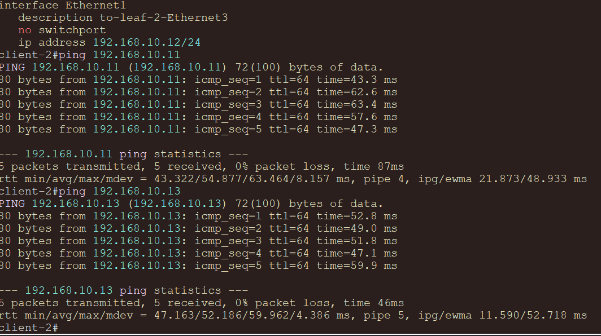
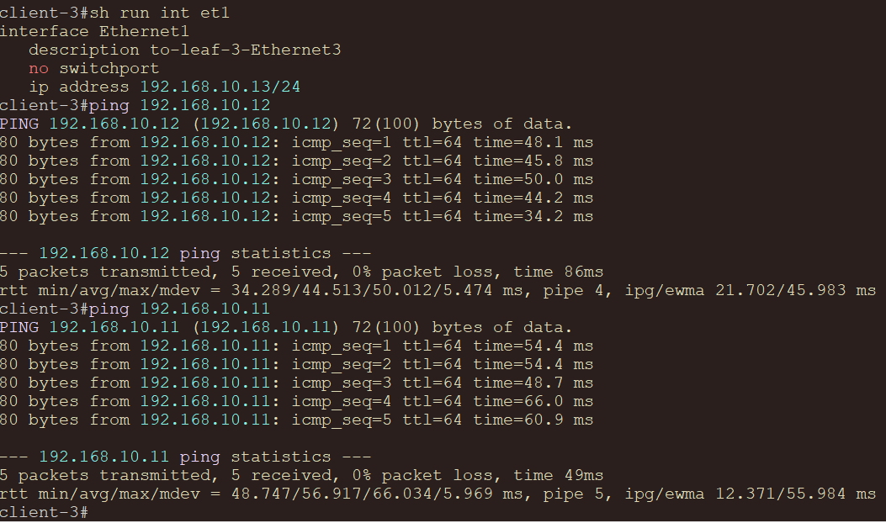

# VxLAN. L2 VNI

## Цель

Настроить overlay на основе VxLAN EVPN для L2-связности между клиентами первой зоны.

## Исходные условия

- Используется CLOS-топология `2 Spine и 3 Leaf` из `lab01`.
- Все сетевые устройства на схеме - `Arista vEOS-lab 4.29.2F`.
- Underlay строится на IPv4/IPv6 eBGP между spine и leaf p2p-линками; в underlay анонсируются только loopback-адреса.
- Overlay строится на `iBGP EVPN` в ASN `65000` между loopback-адресами leaf и spine.
- Spine-устройства не являются VTEP, они работают как EVPN route-reflector'ы.
- Первая клиентская зона: `VLAN 10`, `VNI 10010`.


## План работ

1. Взять схему и underlay-адресацию из `lab01`.
2. Дополнить схему клиентами первой зоны.
3. Настроить eBGP underlay между spine и leaf для IPv4/IPv6 loopback reachability.
4. Настроить iBGP EVPN overlay с двумя spine как route-reflector'ами.
5. Настроить на leaf-устройствах `Vxlan1`, `VLAN 10` и L2 VNI `10010`.
6. Использовать ingress replication через EVPN Type-3 маршруты.
7. Проверить EVPN-соседства, VTEP-таблицу, MAC learning и L2-связность между клиентами.
8. Зафиксировать адресное пространство, схему и конфигурации устройств.

## Схема



## Адресное пространство

### Underlay loopback

| Device | Loopback0 IPv4 | Loopback0 IPv6 | Назначение |
|---|---|---|---|
| `spine-1` | `172.16.1.1/32` | `fd00:172:1::1/128` | BGP router-id, EVPN peering |
| `spine-2` | `172.16.1.2/32` | `fd00:172:1::2/128` | BGP router-id, EVPN peering |
| `leaf-1` | `172.16.10.1/32` | `fd00:172:10::1/128` | BGP router-id, VTEP source |
| `leaf-2` | `172.16.10.2/32` | `fd00:172:10::2/128` | BGP router-id, VTEP source |
| `leaf-3` | `172.16.10.3/32` | `fd00:172:10::3/128` | BGP router-id, VTEP source |

### P2P underlay

| Link | IPv4-subnet | IPv6-subnet |
|---|---|---|
| `spine-1 - leaf-1` | `10.1.1.0/31` | `fd00:10:1:1::/127` |
| `spine-1 - leaf-2` | `10.1.2.0/31` | `fd00:10:1:2::/127` |
| `spine-1 - leaf-3` | `10.1.3.0/31` | `fd00:10:1:3::/127` |
| `spine-2 - leaf-1` | `10.2.1.0/31` | `fd00:10:2:1::/127` |
| `spine-2 - leaf-2` | `10.2.2.0/31` | `fd00:10:2:2::/127` |
| `spine-2 - leaf-3` | `10.2.3.0/31` | `fd00:10:2:3::/127` |

### Подключение клиентов первой зоны

| Client | Client port | Leaf | Leaf port | Leaf port mode | VLAN | VNI | Client IP |
|---|---|---|---|---|---:|---:|---|
| `client-1` | `Ethernet1` | `leaf-1` | `Ethernet3` | access | `10` | `10010` | `192.168.10.11/24` |
| `client-2` | `Ethernet1` | `leaf-2` | `Ethernet3` | access | `10` | `10010` | `192.168.10.12/24` |
| `client-3` | `Ethernet1` | `leaf-3` | `Ethernet3` | access | `10` | `10010` | `192.168.10.13/24` |

Default gateway для проверки L2 VNI не настраивается: клиенты находятся в одном L2-сегменте и проверяются прямым ping внутри `192.168.10.0/24`.

На leaf порт к клиенту настраивается как access-порт в `VLAN 10`:

```text
interface Ethernet3
   description zone-1-client
   switchport mode access
   switchport access vlan 10
   spanning-tree portfast
   no shutdown
```

На клиенте порт к leaf используется как routed interface с IP-адресом клиента:

```text
interface Ethernet1
   description to-leaf-Ethernet3
   no switchport
   ip address 192.168.10.11/24
   no shutdown
```

## Underlay BGP

### Дизайн

- Underlay protocol: `eBGP`.
- Spine underlay ASN: `65100`.
- Leaf underlay ASN: `65201-65203`.
- Underlay-сессии строятся только по p2p-адресам.
- В underlay BGP анонсируются только `Loopback0` IPv4/IPv6.
- На spine используются dynamic neighbors через `peer-group`, `peer-filter` и `bgp listen range`.
- ECMP обеспечивается через `maximum-paths 10` и `bgp bestpath as-path multipath-relax match 1`.
- Быстрое обнаружение отказов: BFD `500/500/3`.

На EOS один BGP process использует один основной ASN. Поэтому в конфигурациях основным ASN выбран overlay ASN `65000`, а underlay eBGP-сессии получают нужный AS_PATH через `local-as`:

```text
router bgp 65000
   neighbor pg-leafs local-as 65100 no-prepend replace-as
```

На leaf используется такой же прием с leaf underlay ASN:

```text
router bgp 65000
   neighbor 10.1.1.0 remote-as 65100
   neighbor 10.1.1.0 local-as 65201 no-prepend replace-as
```

## Overlay EVPN

### Дизайн

- EVPN control plane: `iBGP`.
- Overlay ASN: `65000`.
- Транспорт EVPN-сессий: loopback-to-loopback поверх eBGP underlay.
- Spine role: EVPN route-reflector.
- Leaf role: VTEP и RR-client.
- VTEP: только leaf-устройства.
- VXLAN source interface: `Loopback0`.
- Replication mode: ingress replication через EVPN.
- L2 service: `VLAN 10 <-> VNI 10010`.
- Route Target задан вручную по логике `ASN:VNI`: `65000:10010`.

RT одинаков на всех leaf, чтобы все устройства импортировали маршруты одного L2-домена. Так как overlay работает в одном ASN `65000`, не нужны `rewrite-evpn-rt-asn` и `next-hop-unchanged`.

Для EVPN на EOS используется multi-agent routing protocol model:

```text
service routing protocols model multi-agent
```

### Overlay BGP-соседства

| Device | EVPN neighbors | Remote ASN |
|---|---|---:|
| `leaf-1` | `172.16.1.1`, `172.16.1.2` | `65000` |
| `leaf-2` | `172.16.1.1`, `172.16.1.2` | `65000` |
| `leaf-3` | `172.16.1.1`, `172.16.1.2` | `65000` |
| `spine-1` | dynamic `172.16.10.0/24` | `65000` |
| `spine-2` | dynamic `172.16.10.0/24` | `65000` |

На spine EVPN-соседи leaf принимаются динамически через peer-group `pg-evpn-leafs` и `peer-filter pf-overlay-asns`. В EVPN address-family spine отражает маршруты как route-reflector и не меняет VTEP next-hop.

```text
router bgp 65000
   neighbor pg-evpn-leafs peer group
   neighbor pg-evpn-leafs remote-as 65000
   neighbor pg-evpn-leafs update-source Loopback0
   neighbor pg-evpn-leafs route-reflector-client
   neighbor pg-evpn-leafs send-community extended
   bgp listen range 172.16.10.0/24 peer-group pg-evpn-leafs peer-filter pf-overlay-asns
   !
   address-family evpn
      neighbor pg-evpn-leafs activate
   !
   address-family ipv4
      no neighbor pg-evpn-leafs activate
```

### L2 VNI на leaf

```text
vlan 10
   name ZONE_1
!
interface Ethernet3
   description zone-1-client
   switchport mode access
   switchport access vlan 10
   spanning-tree portfast
!
interface Vxlan1
   vxlan source-interface Loopback0
   vxlan udp-port 4789
   vxlan vlan 10 vni 10010
!
router bgp 65000
   vlan 10
      rd 172.16.10.1:10010
      route-target both 65000:10010
      redistribute learned
```

## Конфигурации устройств

| Устройство | Конфигурация |
|---|---|
| `spine-1` | [configs/spine-1.eos](configs/spine-1.eos) |
| `spine-2` | [configs/spine-2.eos](configs/spine-2.eos) |
| `leaf-1` | [configs/leaf-1.eos](configs/leaf-1.eos) |
| `leaf-2` | [configs/leaf-2.eos](configs/leaf-2.eos) |
| `leaf-3` | [configs/leaf-3.eos](configs/leaf-3.eos) |

## Конфигурации клиентов

Для трех клиентов подготовлены простые конфигурации:

| Client | Config |
|---|---|
| `client-1` | [clients/client-1.eos](clients/client-1.eos) |
| `client-2` | [clients/client-2.eos](clients/client-2.eos) |
| `client-3` | [clients/client-3.eos](clients/client-3.eos) |

На клиенте используется `Ethernet1` как L3-интерфейс. Он подключается к access-порту `Ethernet3` соответствующего leaf:

```text
interface Ethernet1
   no switchport
   ip address 192.168.10.11/24
```

## Проверка

### Underlay

```text
show ip bgp summary
show ip route bgp
ping 172.16.10.1 source 172.16.1.1
ping 172.16.1.1 source 172.16.10.3
```
#### Spine


#### Leaf


### EVPN control plane

```text
show bgp evpn summary
show bgp evpn route-type imet
show bgp evpn route-type mac-ip
```

#### Spine


#### Leaf


Ожидаемые EVPN-соседства:

| Device | EVPN peers |
|---|---:|
| `spine-1` | `3` |
| `spine-2` | `3` |
| `leaf-1` | `2` |
| `leaf-2` | `2` |
| `leaf-3` | `2` |

### VXLAN data plane

```text
show interfaces vxlan 1
show vxlan vtep
show vxlan address-table
show mac address-table vlan 10
```



После генерации трафика между клиентами ожидается:

- на leaf-устройствах появляются удаленные VTEP `172.16.10.1`, `172.16.10.2`, `172.16.10.3`;
- локальные MAC-адреса изучаются на `Ethernet3`;
- удаленные MAC-адреса изучаются через `Vxlan1`;
- EVPN Type-2 маршруты появляются для клиентских MAC;
- EVPN Type-3 IMET маршруты появляются для VNI `10010`.

### Проверка клиентской связности




