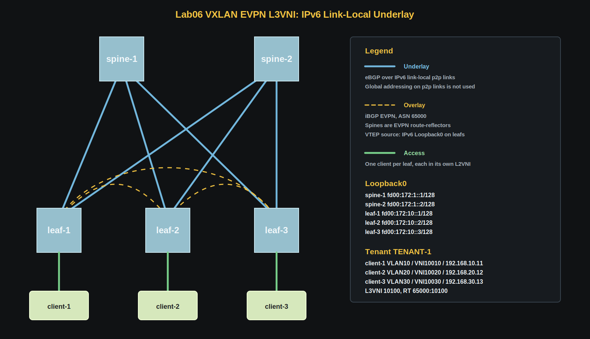
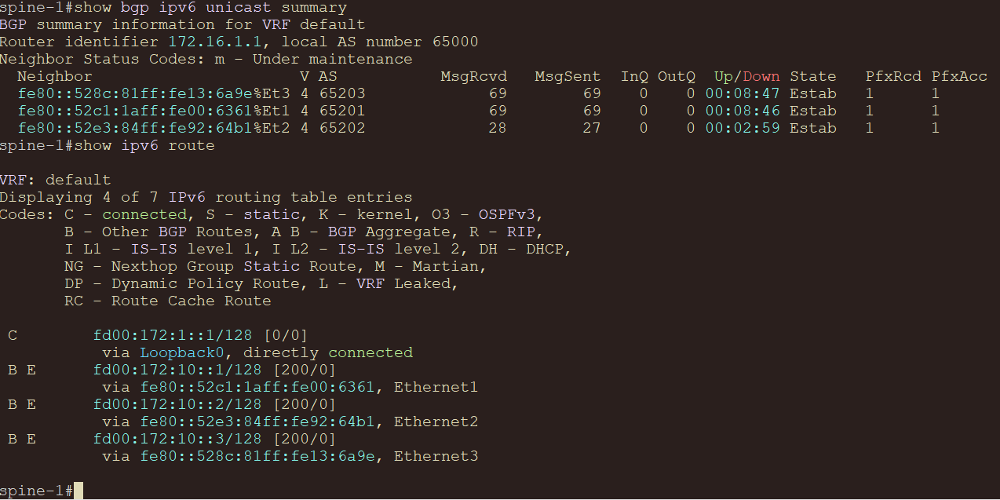
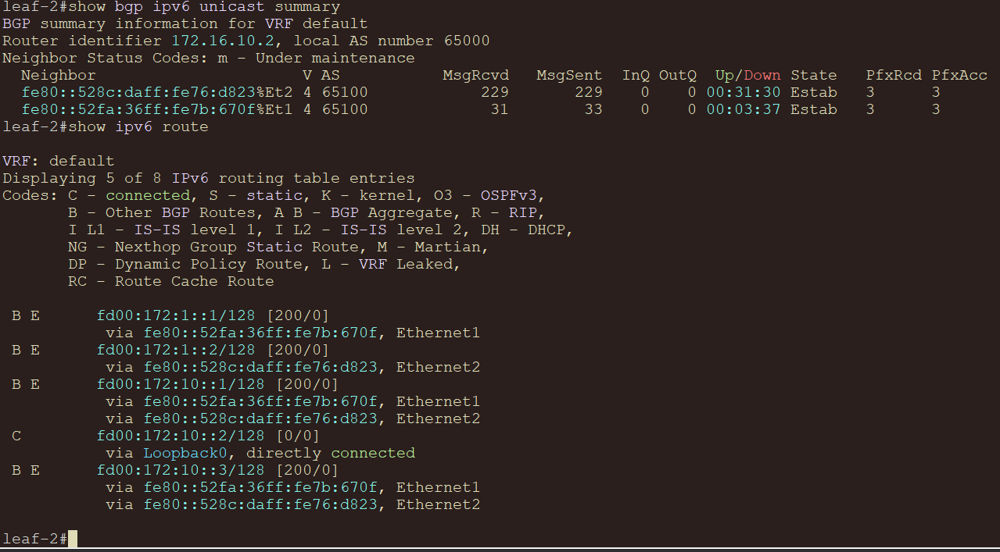
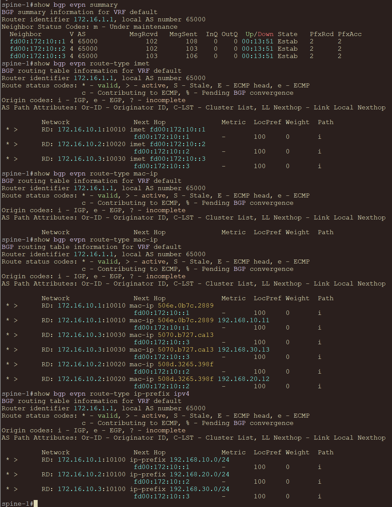
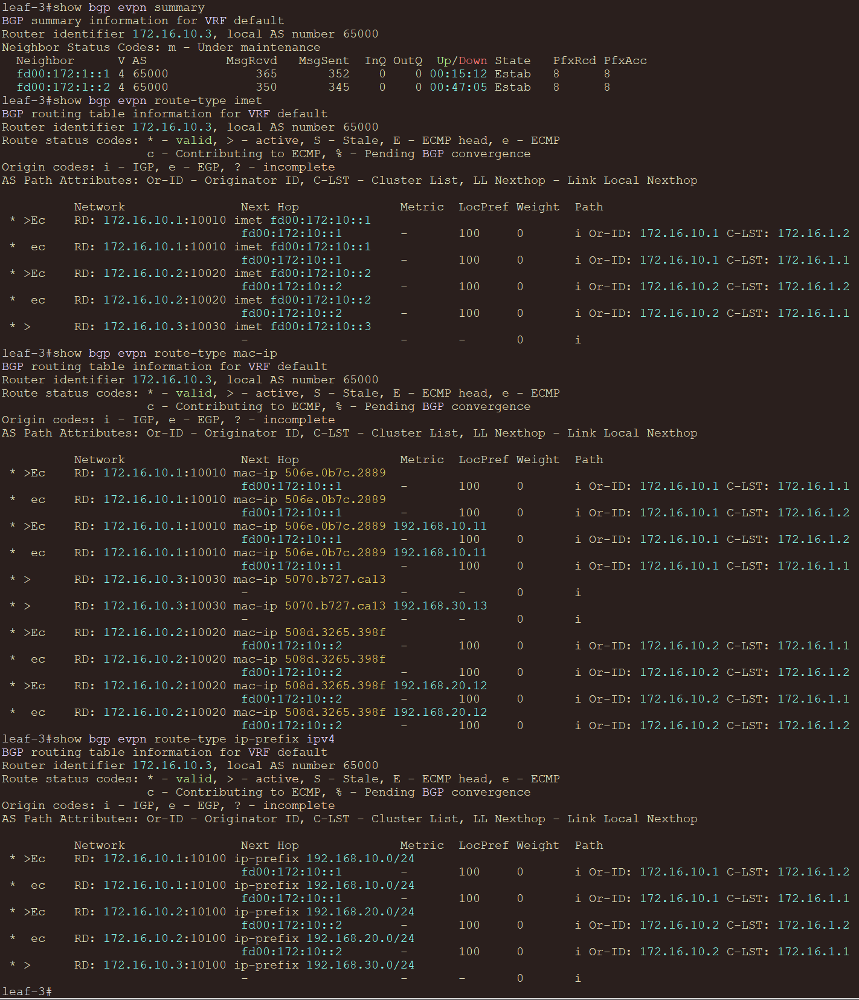
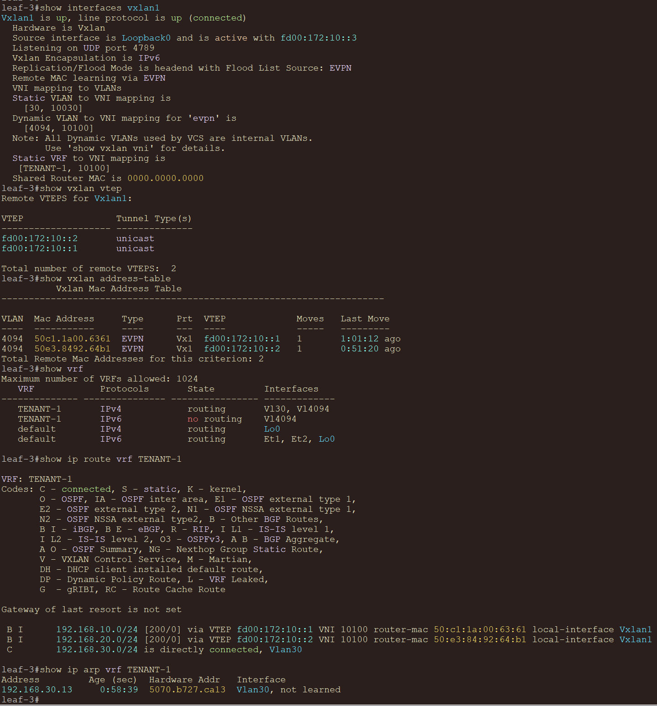
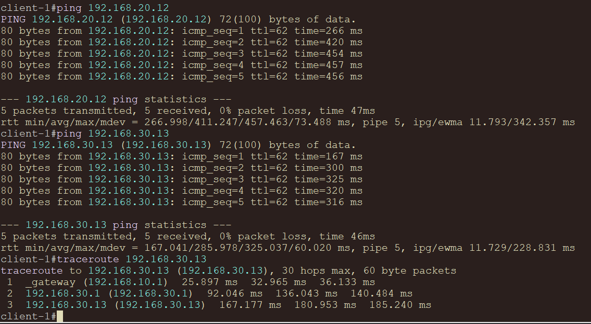
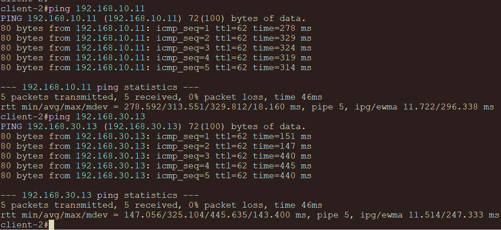
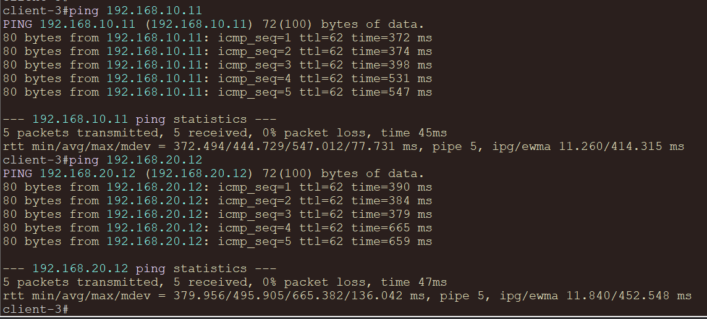

# VxLAN. L3 VNI

## Цель

Настроить маршрутизацию в overlay между клиентами, где каждый клиент находится в своем L2 VNI, а межсетевая маршрутизация выполняется через общий L3 VNI.

## Исходные условия

- Используется CLOS-топология `2 Spine и 3 Leaf` с тремя клиентами.
- Все устройства на схеме - `Arista vEOS-lab 4.29.2F`.
- Underlay строится на `eBGP` поверх IPv6 link-local соседств на p2p-интерфейсах.
- На p2p-линках не используются глобальные IPv4/IPv6 адреса, только `ipv6 enable`.
- VTEP source и EVPN overlay-соседства используют IPv6 loopback-адреса.
- VXLAN data plane использует IPv6 outer header через `vxlan encapsulation ipv6`.
- Overlay строится на `iBGP EVPN` в ASN `65000`.
- Spine-устройства не являются VTEP, они работают как EVPN route-reflector'ы.
- Для маршрутизации между клиентскими сетями используется Symmetric IRB и общий L3 VNI `10100`.

## План работ

1. Подготовить IPv6-only p2p underlay между spine и leaf.
2. Настроить eBGP unnumbered-соседства на физических интерфейсах.
3. Передать IPv6 loopback-адреса через underlay BGP.
4. Настроить iBGP EVPN overlay, где оба spine работают как route-reflector'ы.
5. Настроить на leaf-устройствах локальные L2 VNI для клиентских VLAN.
6. Настроить общий VRF `TENANT-1` и L3 VNI `10100`.
7. Проверить underlay ECMP, EVPN-соседства, VNI-таблицы и маршрутизацию между клиентами.
8. Зафиксировать схему, адресное пространство и конфигурации устройств.

## Схема



## Адресное пространство

### Loopback underlay

| Device | Loopback0 IPv4 | Loopback0 IPv6 | Назначение |
|---|---|---|---|
| `spine-1` | `172.16.1.1/32` | `fd00:172:1::1/128` | IPv4 router-id, IPv6 EVPN RR |
| `spine-2` | `172.16.1.2/32` | `fd00:172:1::2/128` | IPv4 router-id, IPv6 EVPN RR |
| `leaf-1` | `172.16.10.1/32` | `fd00:172:10::1/128` | IPv4 router-id, IPv6 VTEP source |
| `leaf-2` | `172.16.10.2/32` | `fd00:172:10::2/128` | IPv4 router-id, IPv6 VTEP source |
| `leaf-3` | `172.16.10.3/32` | `fd00:172:10::3/128` | IPv4 router-id, IPv6 VTEP source |

IPv4 loopback-и оставлены для привычного `router-id`; в underlay анонсируются IPv6 loopback-и, потому что VTEP и EVPN-соседства работают по IPv6.

### P2P underlay

| Link | Spine port | Leaf port | Адресация |
|---|---|---|---|
| `spine-1 - leaf-1` | `Ethernet1` | `Ethernet1` | IPv6 link-local |
| `spine-1 - leaf-2` | `Ethernet2` | `Ethernet1` | IPv6 link-local |
| `spine-1 - leaf-3` | `Ethernet3` | `Ethernet1` | IPv6 link-local |
| `spine-2 - leaf-1` | `Ethernet1` | `Ethernet2` | IPv6 link-local |
| `spine-2 - leaf-2` | `Ethernet2` | `Ethernet2` | IPv6 link-local |
| `spine-2 - leaf-3` | `Ethernet3` | `Ethernet2` | IPv6 link-local |

На p2p-интерфейсах достаточно включить IPv6:

```text
interface Ethernet1
   no switchport
   ipv6 enable
```

### Клиенты

| Client | Client port | Leaf | Leaf port | VLAN | L2 VNI | Subnet | Gateway |
|---|---|---|---|---:|---:|---|---|
| `client-1` | `Ethernet1` | `leaf-1` | `Ethernet3` | `10` | `10010` | `192.168.10.0/24` | `192.168.10.1` |
| `client-2` | `Ethernet1` | `leaf-2` | `Ethernet3` | `20` | `10020` | `192.168.20.0/24` | `192.168.20.1` |
| `client-3` | `Ethernet1` | `leaf-3` | `Ethernet3` | `30` | `10030` | `192.168.30.0/24` | `192.168.30.1` |

Адреса клиентов:

| Client | IP address | Default gateway |
|---|---|---|
| `client-1` | `192.168.10.11/24` | `192.168.10.1` |
| `client-2` | `192.168.20.12/24` | `192.168.20.1` |
| `client-3` | `192.168.30.13/24` | `192.168.30.1` |

## VNI и VRF

| Назначение | VLAN | VNI | RT | Где используется |
|---|---:|---:|---|---|
| `client-1` L2 segment | `10` | `10010` | `65000:10010` | `leaf-1` |
| `client-2` L2 segment | `20` | `10020` | `65000:10020` | `leaf-2` |
| `client-3` L2 segment | `30` | `10030` | `65000:10030` | `leaf-3` |
| `TENANT-1` L3 segment | - | `10100` | `65000:10100` | `leaf-1`, `leaf-2`, `leaf-3` |

Route Target задан по логике `ASN:VNI`.

## Underlay BGP

### Дизайн

- Underlay protocol: `eBGP`.
- Spine underlay ASN: `65100`.
- Leaf underlay ASN: `65201-65203`.
- P2P transport: IPv6 link-local.
- Underlay prefixes: только IPv6 `Loopback0`.
- ECMP: `maximum-paths 10` и `bgp bestpath as-path multipath-relax match 1`.
- Fast failure detection: BFD `500/500/3`.

Так как в EOS один BGP process использует один основной ASN, основным ASN оставлен overlay ASN `65000`, а underlay eBGP строится через `local-as`:

```text
router bgp 65000
   neighbor pg-spines remote-as 65100
   neighbor pg-spines local-as 65201 no-prepend replace-as
   neighbor interface Ethernet1 peer-group pg-spines remote-as 65100
   neighbor interface Ethernet2 peer-group pg-spines remote-as 65100
```

На spine interface-based peering к leaf задан явно по каждому интерфейсу:

```text
router bgp 65000
   neighbor pg-leafs peer group
   neighbor pg-leafs local-as 65100 no-prepend replace-as
   neighbor interface Ethernet1 peer-group pg-leafs remote-as 65201
   neighbor interface Ethernet2 peer-group pg-leafs remote-as 65202
   neighbor interface Ethernet3 peer-group pg-leafs remote-as 65203
```

При использовании IPv6 link-local underlay важно, чтобы p2p-интерфейс видел только одного IPv6 neighbor. Если после reboot vEOS остался старый link-local сосед, помогает `shutdown/no shutdown` на конкретном p2p-интерфейсе.

## Overlay EVPN

### Дизайн

- EVPN control plane: `iBGP`.
- Overlay ASN: `65000`.
- EVPN peering: leaf IPv6 loopback to spine IPv6 loopback.
- Spine role: EVPN route-reflector.
- Leaf role: VTEP и RR-client.
- VTEP source: IPv6 `Loopback0`.
- VXLAN encapsulation: IPv6.
- L3 routing model: Symmetric IRB.
- Tenant VRF: `TENANT-1`.
- L3 VNI: `10100`.
- Anycast gateway MAC: `00:00:00:00:00:01`.

На каждом leaf есть только локальный клиентский VLAN/L2VNI и общий L3VNI:

```text
interface Vxlan1
   vxlan source-interface Loopback0
   vxlan encapsulation ipv6
   vxlan vlan 10 vni 10010
   vxlan vrf TENANT-1 vni 10100
```

SVI клиента находится в VRF и работает как anycast gateway:

```text
interface Vlan10
   vrf TENANT-1
   ip address virtual 192.168.10.1/24
```

EVPN RT для L3VNI общий на всех leaf:

```text
router bgp 65000
   vrf TENANT-1
      rd 172.16.10.1:10100
      route-target import evpn 65000:10100
      route-target export evpn 65000:10100
      redistribute connected
```

## Конфигурации устройств

| Устройство | Конфигурация |
|---|---|
| `spine-1` | [configs/spine-1.eos](configs/spine-1.eos) |
| `spine-2` | [configs/spine-2.eos](configs/spine-2.eos) |
| `leaf-1` | [configs/leaf-1.eos](configs/leaf-1.eos) |
| `leaf-2` | [configs/leaf-2.eos](configs/leaf-2.eos) |
| `leaf-3` | [configs/leaf-3.eos](configs/leaf-3.eos) |
| `client-1` | [clients/client-1.eos](clients/client-1.eos) |
| `client-2` | [clients/client-2.eos](clients/client-2.eos) |
| `client-3` | [clients/client-3.eos](clients/client-3.eos) |

## Проверка

### Underlay

```text
show bgp ipv6 unicast summary
show ipv6 route fd00:172:10::2/128
ping fd00:172:10::2 source fd00:172:10::1
```

На leaf до loopback другого leaf должно быть два равнозначных пути через оба spine.

#### Spine



#### Leaf



### EVPN control plane

```text
show bgp evpn summary
show bgp evpn route-type imet
show bgp evpn route-type mac-ip
show bgp evpn route-type ip-prefix
```

#### Spine



#### Leaf



### VXLAN и VRF

```text
show interfaces vxlan1
show vxlan vtep
show vxlan address-table
show vrf
show ip route vrf TENANT-1
show ip arp vrf TENANT-1
```



### Проверка клиентов

С `client-1`:

```text
ping 192.168.20.12
ping 192.168.30.13
traceroute 192.168.30.13
```



С `client-2`:

```text
ping 192.168.10.11
ping 192.168.30.13
```



С `client-3`:

```text
ping 192.168.10.11
ping 192.168.20.12
```


