# VxLAN. EVPN Multihoming

## Цель

Настроить отказоустойчивое подключение клиента к разным leaf-устройствам с использованием EVPN Multihoming.

## Исходные условия

- Используется CLOS-топология `2 Spine и 3 Leaf`.
- Underlay, overlay и L3VNI взяты из `lab06`: eBGP over IPv6 link-local, iBGP EVPN, VXLAN over IPv6.
- Spine-устройства работают как EVPN route-reflector'ы.
- `client-3` подключается двумя линками к разным leaf: `leaf-2` и `leaf-3`.
- На стороне клиента используется LACP Port-Channel.
- На leaf-устройствах используется EVPN Ethernet Segment, то есть ESI-LAG без классического MLAG peer-link.

## План работ

1. Взять рабочую EVPN L3VNI fabric из `lab06`.
2. Добавить к `leaf-2` VLAN/VNI клиента `client-3`.
3. Настроить на `leaf-2` и `leaf-3` общий ESI-LAG для `client-3`.
4. Настроить LACP Port-Channel на клиенте.
5. Проверить LACP, Ethernet Segment, EVPN routes и связность между клиентами.
6. Проверить отказоустойчивость при отключении одного из линков `client-3`.

## Схема

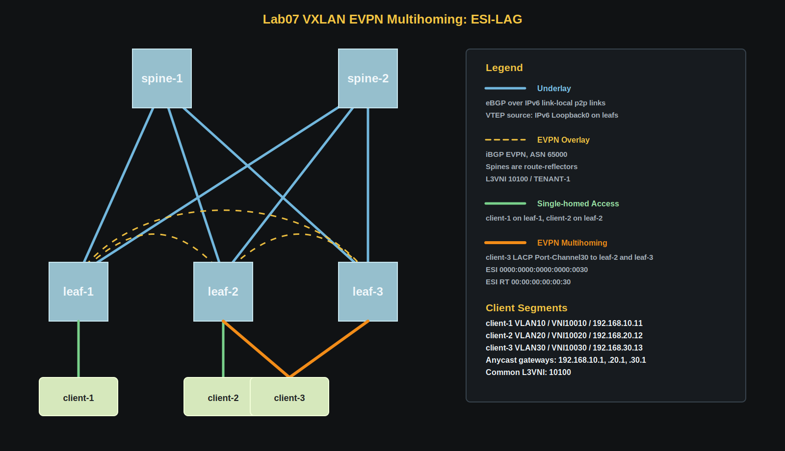

## Адресное пространство

### Loopback underlay

| Device | Loopback0 IPv4 | Loopback0 IPv6 | Назначение |
|---|---|---|---|
| `spine-1` | `172.16.1.1/32` | `fd00:172:1::1/128` | IPv4 router-id, IPv6 EVPN RR |
| `spine-2` | `172.16.1.2/32` | `fd00:172:1::2/128` | IPv4 router-id, IPv6 EVPN RR |
| `leaf-1` | `172.16.10.1/32` | `fd00:172:10::1/128` | IPv4 router-id, IPv6 VTEP source |
| `leaf-2` | `172.16.10.2/32` | `fd00:172:10::2/128` | IPv4 router-id, IPv6 VTEP source |
| `leaf-3` | `172.16.10.3/32` | `fd00:172:10::3/128` | IPv4 router-id, IPv6 VTEP source |

### Клиенты

| Client | Подключение | VLAN | L2 VNI | Subnet | Gateway |
|---|---|---:|---:|---|---|
| `client-1` | `leaf-1 Ethernet3` | `10` | `10010` | `192.168.10.0/24` | `192.168.10.1` |
| `client-2` | `leaf-2 Ethernet3` | `20` | `10020` | `192.168.20.0/24` | `192.168.20.1` |
| `client-3` | `leaf-2 Ethernet4` + `leaf-3 Ethernet3` | `30` | `10030` | `192.168.30.0/24` | `192.168.30.1` |

Адреса клиентов:

| Client | IP address | Default gateway |
|---|---|---|
| `client-1` | `192.168.10.11/24` | `192.168.10.1` |
| `client-2` | `192.168.20.12/24` | `192.168.20.1` |
| `client-3` | `192.168.30.13/24` | `192.168.30.1` |

## VNI и VRF

| Назначение | VLAN | VNI | RT | Где используется |
|---|---:|---:|---|---|
| `client-1` L2 segment | `10` | `10010` | `65000:10010` | `leaf-1` |
| `client-2` L2 segment | `20` | `10020` | `65000:10020` | `leaf-2` |
| `client-3` L2 segment | `30` | `10030` | `65000:10030` | `leaf-2`, `leaf-3` |
| `TENANT-1` L3 segment | - | `10100` | `65000:10100` | `leaf-1`, `leaf-2`, `leaf-3` |

## EVPN Multihoming

`client-3` подключен через LACP Port-Channel к двум разным leaf-устройствам. Для fabric это один Ethernet Segment:

| Параметр | Значение |
|---|---|
| Client Port-Channel | `Port-Channel30` |
| Leaf Port-Channel | `Port-Channel30` |
| ESI | `0000:0000:0000:0000:0030` |
| ESI route-target | `00:00:00:00:00:30` |
| LACP system-id на leaf | `0200.0000.0030` |
| DF preference на `leaf-2` | `200` |
| DF preference на `leaf-3` | `100` |

Одинаковые `identifier`, `route-target import` и `lacp system-id` на `leaf-2` и `leaf-3` позволяют клиенту видеть два разных leaf как один LACP-сосед.

На leaf-устройствах дополнительно используется `vxlan learn-restrict any`, чтобы remote MAC learning выполнялся через EVPN control-plane.

Фрагмент конфигурации leaf:

```text
interface Port-Channel30
   description client-3-esi-lag
   switchport mode trunk
   switchport trunk allowed vlan 30
   !
   evpn ethernet-segment
      identifier 0000:0000:0000:0000:0030
      designated-forwarder election algorithm preference 200
      route-target import 00:00:00:00:00:30
   lacp system-id 0200.0000.0030
```

Фрагмент конфигурации клиента:

```text
interface Port-Channel30
   description esi-lag-to-leaf-2-leaf-3
   switchport mode trunk
   switchport trunk allowed vlan 30
```

## Конфигурации устройств

| Устройство | Конфигурация |
|---|---|
| `spine-1` | [configs/spine-1.eos](configs/spine-1.eos) |
| `spine-2` | [configs/spine-2.eos](configs/spine-2.eos) |
| `leaf-1` | [configs/leaf-1.eos](configs/leaf-1.eos) |
| `leaf-2` | [configs/leaf-2.eos](configs/leaf-2.eos) |
| `leaf-3` | [configs/leaf-3.eos](configs/leaf-3.eos) |
| `client-1` | [clients/client-1.eos](clients/client-1.eos) |
| `client-2` | [clients/client-2.eos](clients/client-2.eos) |
| `client-3` | [clients/client-3.eos](clients/client-3.eos) |

## Проверка

### Underlay и overlay

```text
show bgp ipv6 unicast summary
show bgp evpn summary
show vxlan vtep
```

#### Spine

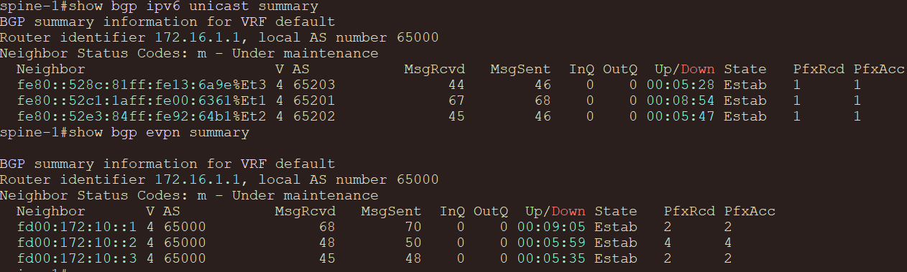

#### Leaf

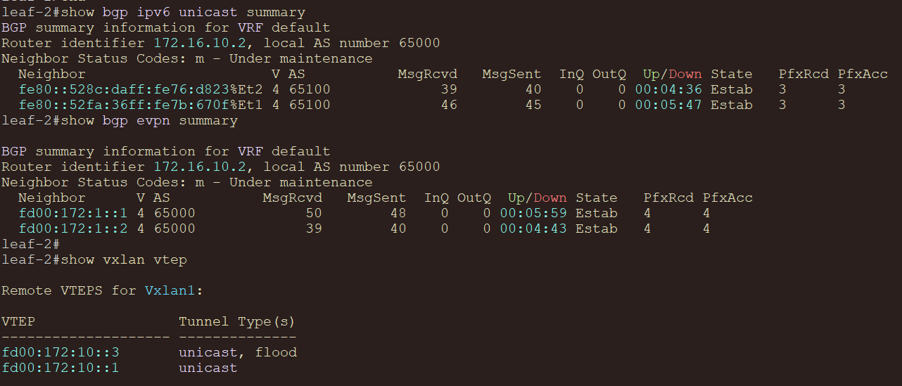

### LACP и Port-Channel

На `client-3`, `leaf-2` и `leaf-3`:

```text
show port-channel dense
show lacp peer
show interfaces port-channel 30
```

#### Client-3

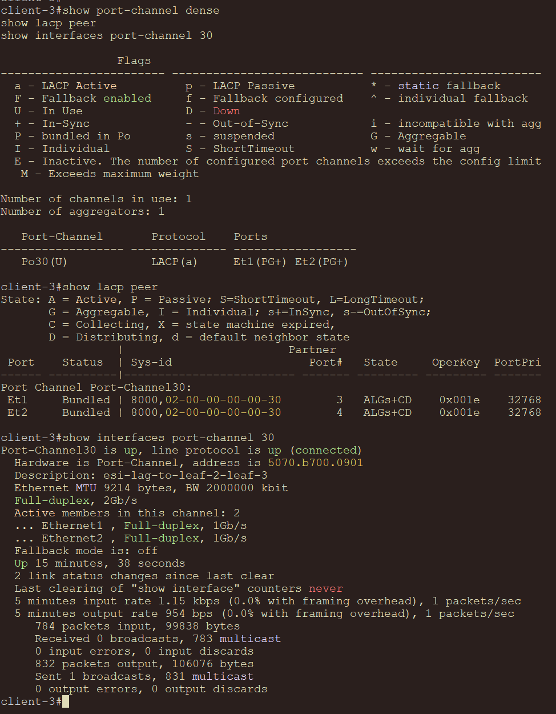

#### Leaf-2

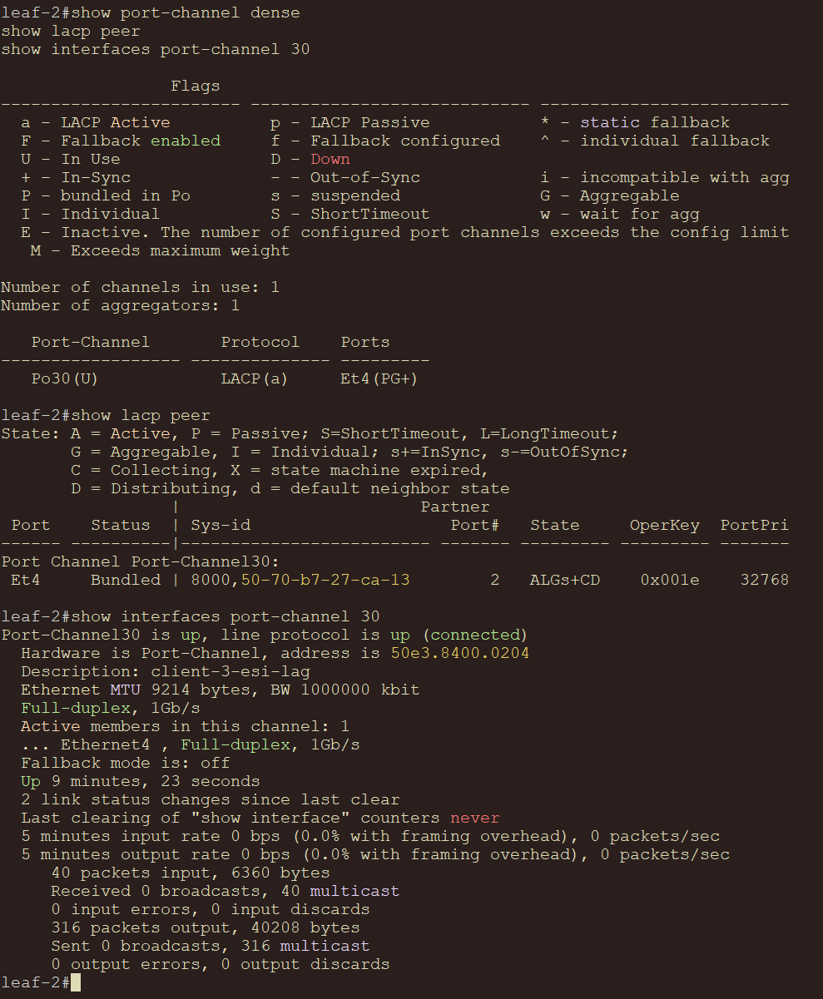

#### Leaf-3

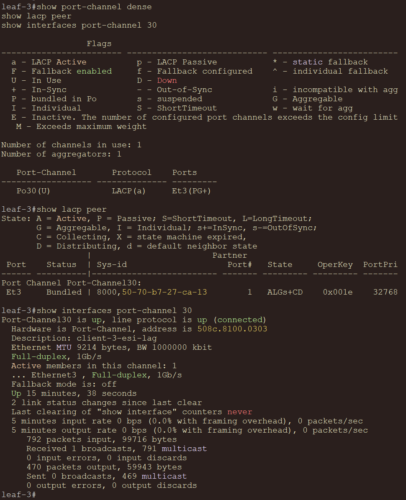

### EVPN Ethernet Segment

На `leaf-2` и `leaf-3`:

```text
show bgp evpn route-type ethernet-segment
show bgp evpn route-type auto-discovery
show bgp evpn route-type mac-ip
show running-config interfaces port-channel 30
```

Ожидаемо `leaf-2` и `leaf-3` должны анонсировать общий Ethernet Segment для `client-3`, а в EVPN должны появиться route-type 4 Ethernet Segment и route-type 1 Auto-Discovery маршруты.

#### Leaf-2

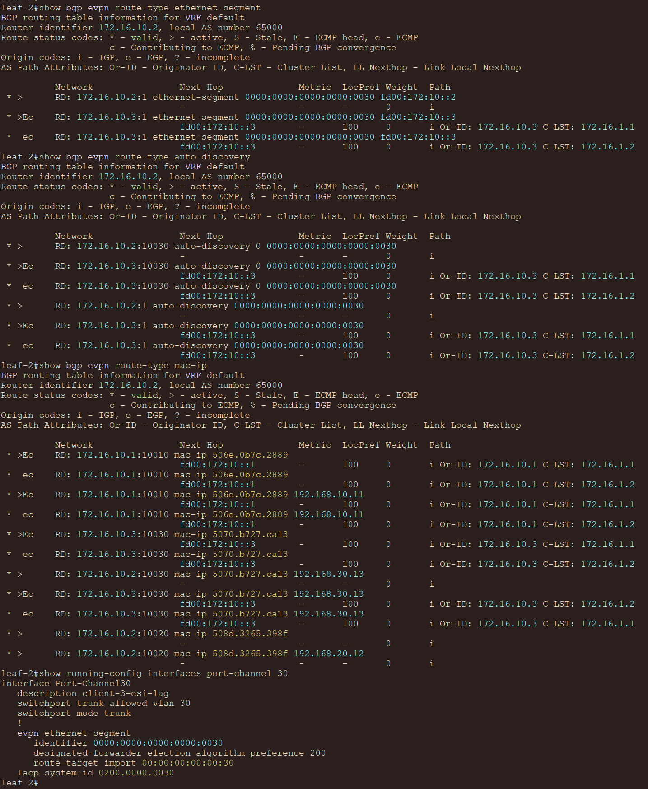

#### Leaf-3

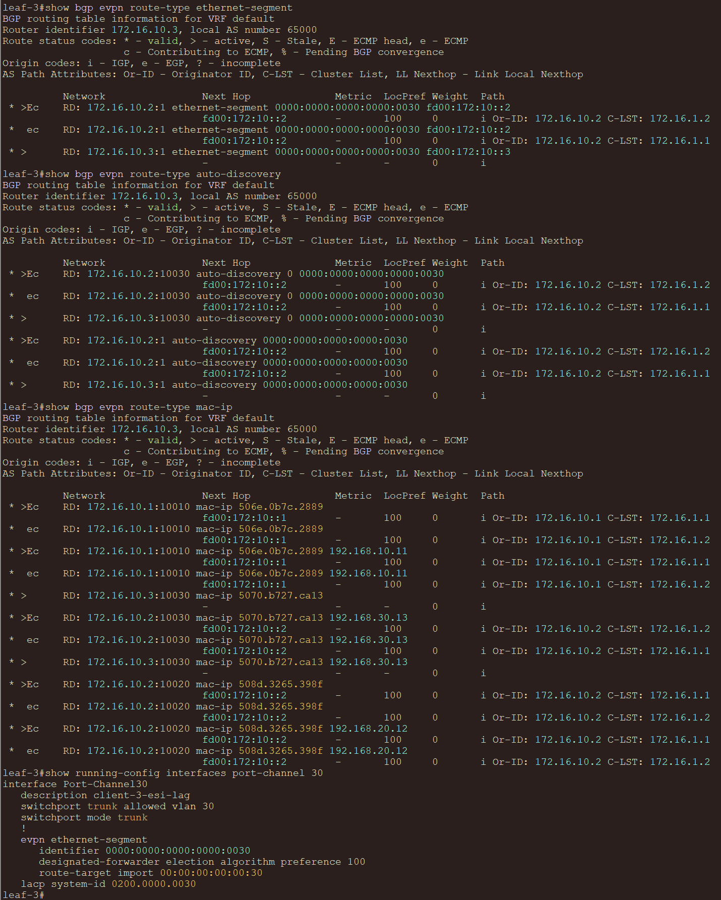

### VXLAN и маршрутизация

```text
show interfaces vxlan1
show vxlan address-table
show ip route vrf TENANT-1
show ip arp vrf TENANT-1
```

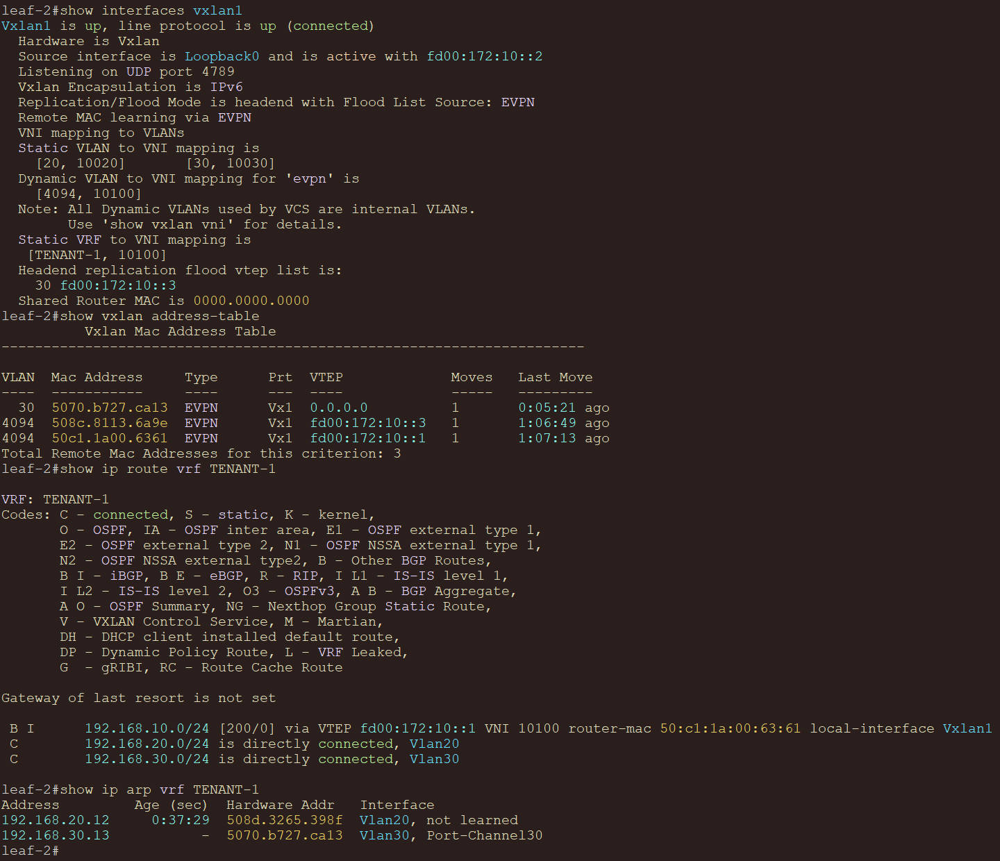

### Проверка связности

С `client-3`:

```text
ping 192.168.10.11
ping 192.168.20.12
```

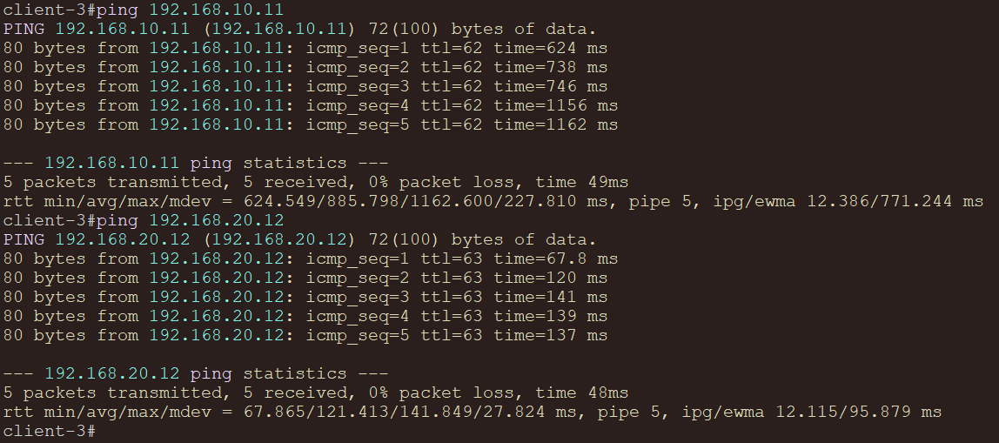

С `client-1`:

```text
ping 192.168.30.13
```

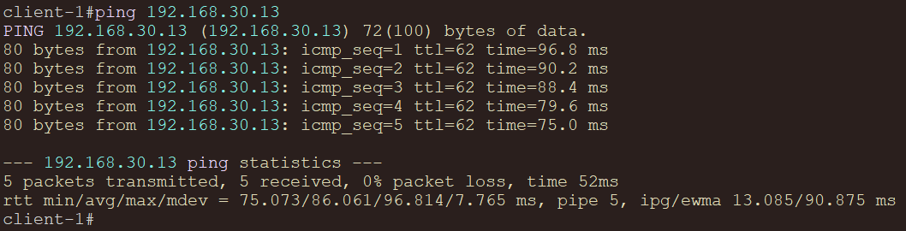

### Проверка отказоустойчивости

Во время непрерывного ping с `client-3` можно отключить один из линков:

```text
conf t
interface Ethernet1
shutdown
```

После отключения одного линка Port-Channel должен остаться `up`, а связность с остальными клиентами должна сохраниться.

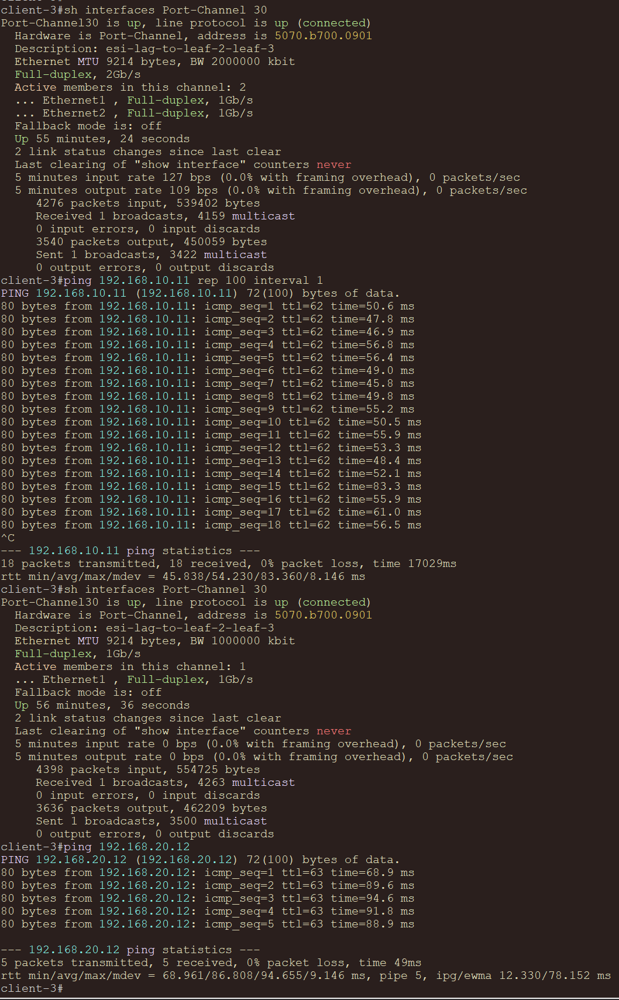
