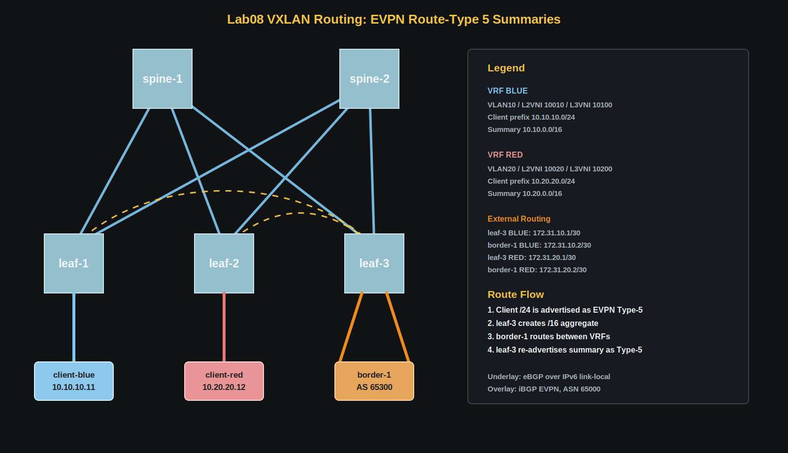
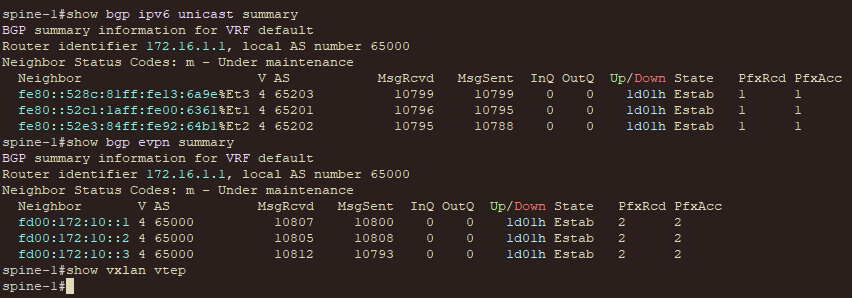
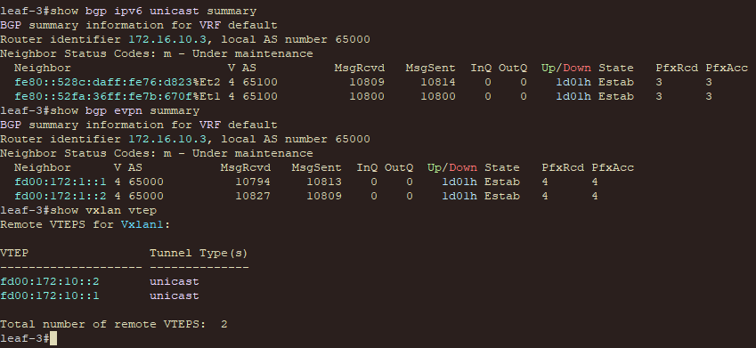
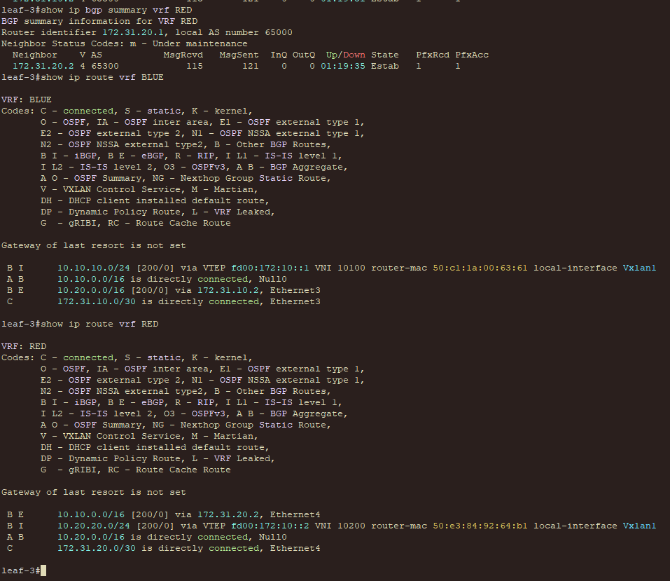
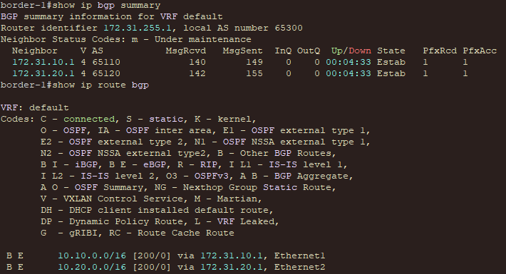
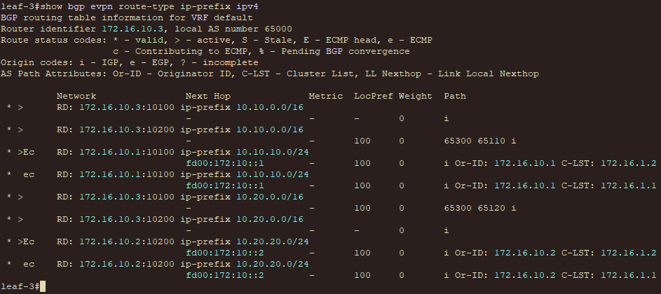
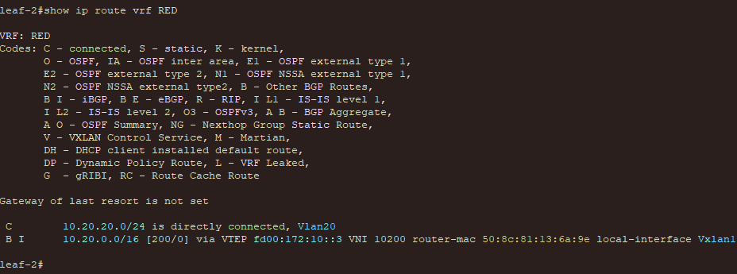
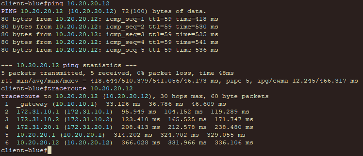
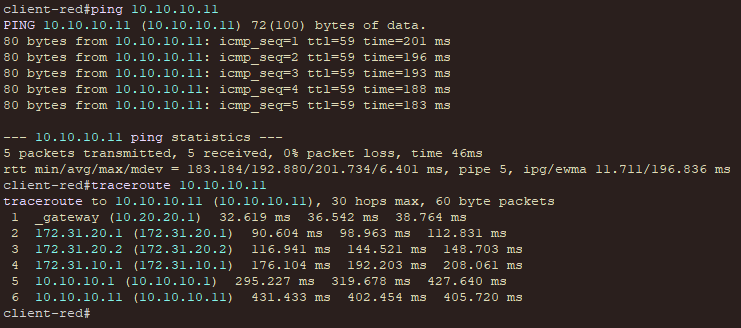

# VxLAN. Routing через EVPN Route-Type 5

## Цель

Реализовать передачу суммарных IP-префиксов через EVPN route-type 5 и настроить маршрутизацию между клиентами из разных VRF через внешнее устройство.

## Исходные условия

- Используется CLOS-топология `2 Spine и 3 Leaf`.
- Underlay строится на eBGP поверх IPv6 link-local.
- Overlay строится на iBGP EVPN в ASN `65000`.
- Spine-устройства работают как EVPN route-reflector'ы.
- `leaf-3` выполняет роль border leaf.
- `border-1` не участвует в VXLAN fabric и выполняет внешнюю маршрутизацию между VRF.
- `client-blue` находится в VRF `BLUE`, а `client-red` - в VRF `RED`.

## План работ

1. Взять IPv6 EVPN fabric из предыдущих лабораторных работ.
2. Создать VRF `BLUE` и `RED` с отдельными L3VNI.
3. Подключить клиентов к разным leaf и разместить их в разных VRF.
4. Настроить `leaf-3` как border leaf для обоих VRF.
5. Подключить к `leaf-3` внешний router двумя routed-линками.
6. Сформировать на border leaf суммарные маршруты `/16`.
7. Передать summary-префиксы через внешний router в противоположный VRF.
8. Распространить полученные маршруты внутри fabric через EVPN route-type 5.
9. Проверить BGP, Type-5 маршруты и связность между клиентами.

## Схема



## Адресное пространство

### Loopback underlay

| Device | Loopback0 IPv4 | Loopback0 IPv6 | Назначение |
|---|---|---|---|
| `spine-1` | `172.16.1.1/32` | `fd00:172:1::1/128` | IPv4 router-id, EVPN RR |
| `spine-2` | `172.16.1.2/32` | `fd00:172:1::2/128` | IPv4 router-id, EVPN RR |
| `leaf-1` | `172.16.10.1/32` | `fd00:172:10::1/128` | BLUE VTEP |
| `leaf-2` | `172.16.10.2/32` | `fd00:172:10::2/128` | RED VTEP |
| `leaf-3` | `172.16.10.3/32` | `fd00:172:10::3/128` | Border VTEP |
| `border-1` | `172.31.255.1/32` | - | BGP router-id |

### Клиентские сети

| VRF | Client | Leaf | VLAN | L2VNI | Subnet | Gateway |
|---|---|---|---:|---:|---|---|
| `BLUE` | `client-blue` | `leaf-1` | `10` | `10010` | `10.10.10.0/24` | `10.10.10.1` |
| `RED` | `client-red` | `leaf-2` | `20` | `10020` | `10.20.20.0/24` | `10.20.20.1` |

Адреса клиентов:

| Client | IP address | Default gateway |
|---|---|---|
| `client-blue` | `10.10.10.11/24` | `10.10.10.1` |
| `client-red` | `10.20.20.12/24` | `10.20.20.1` |

### Border links

| VRF | Leaf-3 interface | Leaf-3 IP | Border interface | Border IP |
|---|---|---|---|---|
| `BLUE` | `Ethernet3` | `172.31.10.1/30` | `Ethernet1` | `172.31.10.2/30` |
| `RED` | `Ethernet4` | `172.31.20.1/30` | `Ethernet2` | `172.31.20.2/30` |

## VNI и VRF

| Назначение | VLAN | VNI | RT | Где используется |
|---|---:|---:|---|---|
| BLUE client segment | `10` | `10010` | `65000:10010` | `leaf-1` |
| RED client segment | `20` | `10020` | `65000:10020` | `leaf-2` |
| BLUE IP-VRF | - | `10100` | `65000:10100` | `leaf-1`, `leaf-3` |
| RED IP-VRF | - | `10200` | `65000:10200` | `leaf-2`, `leaf-3` |

VRF имеют разные route-target, поэтому напрямую маршруты друг друга не импортируют.

## Суммаризация

На `leaf-3` формируются summary-префиксы:

| VRF | Specific prefix | Summary |
|---|---|---|
| `BLUE` | `10.10.10.0/24` | `10.10.0.0/16` |
| `RED` | `10.20.20.0/24` | `10.20.0.0/16` |

Конфигурация BLUE:

```text
router bgp 65000
   vrf BLUE
      aggregate-address 10.10.0.0/16 summary-only
```

Конфигурация RED:

```text
router bgp 65000
   vrf RED
      aggregate-address 10.20.0.0/16 summary-only
```

Параметр `summary-only` не позволяет отправлять внешнему router более специфичный `/24`: вместо него передается только суммарный `/16`.

## Меж-VRF маршрутизация

Внутри fabric VRF `BLUE` и `RED` остаются изолированными. Обмен маршрутами выполняет `border-1`:

1. `leaf-3` получает клиентский `/24` через EVPN Type-5.
2. `leaf-3` формирует соответствующий summary `/16`.
3. Summary передается по eBGP на `border-1`.
4. `border-1` передает маршрут через вторую BGP-сессию обратно в противоположный VRF.
5. `leaf-3` экспортирует внешний BGP-маршрут в EVPN с RT нужного VRF.
6. Клиентский leaf получает summary как EVPN route-type 5 с next-hop на border VTEP.

Для eBGP-сессий к `border-1` используются отдельные локальные ASN на стороне `leaf-3`. Так маршруты, вышедшие из одного VRF и вернувшиеся в другой VRF, не содержат fabric ASN `65000` в AS_PATH и не отбрасываются клиентскими leaf как AS-loop:

```text
router bgp 65000
   vrf BLUE
      neighbor 172.31.10.2 local-as 65110 no-prepend replace-as
   vrf RED
      neighbor 172.31.20.2 local-as 65120 no-prepend replace-as

router bgp 65300
   neighbor 172.31.10.1 remote-as 65110
   neighbor 172.31.20.1 remote-as 65120
```

Без этого клиентские leaf могут отбросить EVPN route-type 5, потому что внутри fabric их локальный ASN тоже `65000`.

## Ожидаемые маршруты

На `border-1`:

```text
10.10.0.0/16 via 172.31.10.1
10.20.0.0/16 via 172.31.20.1
```

На `leaf-1` в VRF `BLUE`:

```text
10.10.10.0/24 directly connected
10.20.0.0/16 via VTEP fd00:172:10::3, VNI 10100
```

На `leaf-2` в VRF `RED`:

```text
10.20.20.0/24 directly connected
10.10.0.0/16 via VTEP fd00:172:10::3, VNI 10200
```

## Конфигурации устройств

| Устройство | Конфигурация |
|---|---|
| `spine-1` | [configs/spine-1.eos](configs/spine-1.eos) |
| `spine-2` | [configs/spine-2.eos](configs/spine-2.eos) |
| `leaf-1` | [configs/leaf-1.eos](configs/leaf-1.eos) |
| `leaf-2` | [configs/leaf-2.eos](configs/leaf-2.eos) |
| `leaf-3` | [configs/leaf-3.eos](configs/leaf-3.eos) |
| `border-1` | [configs/border-1.eos](configs/border-1.eos) |
| `client-blue` | [clients/client-blue.eos](clients/client-blue.eos) |
| `client-red` | [clients/client-red.eos](clients/client-red.eos) |

## Проверка

### Underlay и EVPN overlay

```text
show bgp ipv6 unicast summary
show bgp evpn summary
show vxlan vtep
```



### BGP с внешним router

На `leaf-3`:

```text
show ip bgp summary vrf BLUE
show ip bgp summary vrf RED
show ip route vrf BLUE
show ip route vrf RED
```

На `border-1`:

```text
show ip bgp summary
show ip route bgp
```


### EVPN route-type 5

```text
show bgp evpn route-type ip-prefix ipv4
```


В выводе должны присутствовать summary-префиксы `10.10.0.0/16` и `10.20.0.0/16` с route-target соответствующих VRF.

### Проверка клиентских leaf

На `leaf-1`:

```text
show ip route vrf BLUE
```


На `leaf-2`:

```text
show ip route vrf RED
```


### Проверка связности

С `client-blue`:

```text
ping 10.20.20.12
traceroute 10.20.20.12
```


С `client-red`:

```text
ping 10.10.10.11
traceroute 10.10.10.11
```

Трафик должен пройти через ingress leaf, VXLAN fabric до `leaf-3`, внешний `border-1`, обратно на `leaf-3` в другом VRF и затем через fabric к удаленному клиенту.